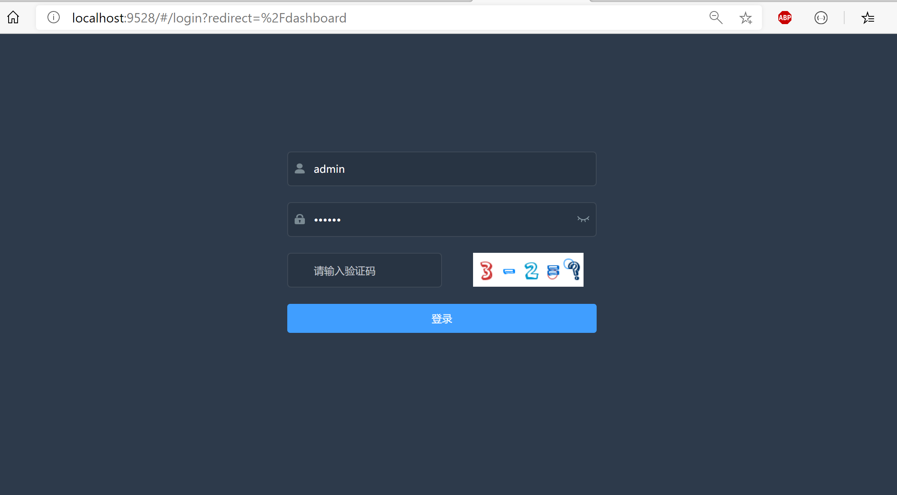

### 开始之前
之前都是写代码的同时写博客，感觉很费时间，接下来会换一种方式，先写好代码，再编写博客，代码也只粘出重要部分。
### 本章前提
- 了解vue
- 了解SpringBoot
- 了解redis

### 本章内容
[前端代码](https://github.com/gqiwei/guai_ui/tree/lab-04)  
[后端代码](https://github.com/gqiwei/guai/tree/lab-04)  

# 上章补充
上一章中JWT生成token中加入了过期时间，实际中的情况是在token快过期的时候，用户若还在操作的话，会对token过期时间进行刷新，按照现在的代码逻辑来，刷新过期时间就意味着token变化，但前端储存的token依旧是之前的，这存在大问题。  
现在的解决方案是：JWT生成的token不设置过期时间，将token存入redis中，用redis来管理过期时间。
## 相关代码
添加reids的pom依赖。
``` xml
<dependency>
  <groupId>org.springframework.boot</groupId>
  <artifactId>spring-boot-starter-data-redis</artifactId>
</dependency>
```
### 修改token的生成逻辑。
之前在数据声明中加入了用户信息，以方便读取，现在则是将用户信息存入至reids中，数据声明只加入reids对应的key。
``` java
public String generateToken(SecurityUser userDetail) {
    userDetail.setExpireTime(DateUtil.getNowDateTimestamp()+expireTime*60*1000); //设置过期时间
    String key = IdUtil.getUNID();// reids key
    refreshToken(userDetail,key);
    Map<String, Object> claims = new HashMap<>(1);
    claims.put(REDIS_KEY,key);
    return generateToken(claims);
    }
```
取消JWT的过期时间设置，将过期时间放到redis中。
``` java
private String generateToken(Map<String, Object> claims) {
    return Jwts.builder().setClaims(claims).signWith(SignatureAlgorithm.HS512, secret).compact();
}
```
``` java
private void refreshToken(SecurityUser user,String key){
    redisTemplate.opsForValue().set(key,user,expireTime, TimeUnit.MINUTES);
}
```
### 修改验证过程
之前是从数据声明中取出用户信息，现在则只需要取出reids的key，再根据key从redis获取到用户信息，然后在对过期时间进行判断，如果要刷新过期时间则将用户信息重新存入redis中。
``` java
public SecurityUser getSecurityUser(HttpServletRequest request){
    String token = getToken(request);
    if(StringUtils.isNotEmpty(token)){

        .
        .
        .

        String key = claims.get(REDIS_KEY).toString();
        // 1 从redis中获取用户信息
        SecurityUser user =(SecurityUser) redisTemplate.opsForValue().get(key);
        // 2 判断是否到reids中用户信息过期刷新时间
        long user_expireTime = user.getExpireTime();
        long currentTime = DateUtil.getNowDateTimestamp();
        if (user_expireTime - currentTime <= MIN_REFRESH_TIME){
            // 2.1 刷新用户信息
            user.setExpireTime(user.getExpireTime()+expireTime*60*1000);
            refreshToken(user,key);
        }
        return  user;
    }
    return null;
}
```
# 添加验证码
为了快速开发，使用了[EasyCaptcha](https://gitee.com/whvse/EasyCaptcha)，只需要几行代码就可以生成验证码图片。  
验证码的主要逻辑是，进入登录页面请求接口生成验证码，验证码会存入redis，登录时再从redis取出对比。
## 相关代码
pom依赖
``` xml
<dependency>
    <groupId>com.github.whvcse</groupId>
    <artifactId>easy-captcha</artifactId>
    <version>1.6.2</version>
</dependency>
```
### 获取验证码接口
``` java
 @GetMapping("/loginCode")
public R loginCode(){
    ArithmeticCaptcha captcha = new ArithmeticCaptcha(130, 48);
    captcha.setLen(2);  // 几位数运算，默认是两位
    String result = captcha.text();  // 获取运算的结果：

    String key = IdUtil.getUNID();
    redisTemplate.opsForValue().set( key, result, 5, TimeUnit.MINUTES); //储存5分钟
    CodeVO codeVO = new CodeVO();
    codeVO.setKey(key);
    codeVO.setSrc(captcha.toBase64());

    return R.ok(codeVO);
}
```
然后将此接口加入`SecurityConfig`的匿名访问，不然会请求不到。
``` java
.antMatchers("/login","/loginCode","/test","/druid/**","favicon.ico").anonymous()
```
### 修改登录验证逻辑
`LoginMessageDTO`增加两个属性`key`和`code`，用于接收验证码code，以及验证码存入reids中的key。  
然后在原来的登录逻辑中添加验证码的判断。
``` java
// SysUserServiceImpl#login
String captcha =(String) redisTemplate.opsForValue().get(key);
if(code == null ||code.isEmpty()){
    throw new BaseException("验证码为空");
}
if(captcha == null){
    throw new BaseException("验证码过期");
}
if(!code.equals(captcha)){
    throw new BaseException("验证码错误");
}
redisTemplate.delete(key); //删除reids
```

### 前端修改
增加验证码一行。
``` html
<el-form-item>
    <el-col :span="12" style="overflow:hidden">
        <el-form-item prop="captcha">
            <el-input
              v-model="loginForm.code"
              type="test"
              auto-complete="off"
              placeholder="请输入验证码"
              style="width: 100%;"
              @keyup.enter.native="handleLogin"
            />
        </el-form-item>
    </el-col>

    <el-col :span="11">
        <el-form-item>
            
        </el-form-item>
    </el-col>
</el-form-item>
```
以及获取验证码图片。
``` js
created(){
    this.refreshCaptcha()
}
```
``` js
refreshCaptcha(){
    getCode().then(response => {
        console.log(response);
        this.src = response.data.src;
        this.loginForm.key = response.data.key;
    })
    console.log('刷新验证码')
}
```
新创建接口请求
``` js
export function getCode(){
    return request({
        url:'/loginCode',
        method:'get'
    })
}
```
### 结果展示
对于登录页面，我进行了其他样式上的调整，最终效果为以下：


# 


