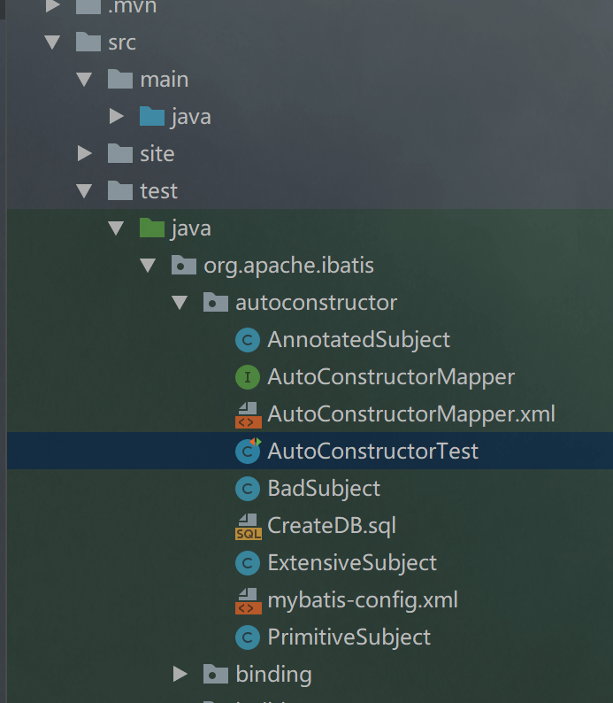

mybatis是现在流行的持久层框架，现在这家公司也从之前的ssh项目慢慢转成了ssm项目，而我之前用过ibatis，ibatis正是mybatis的前身。故想找时间来阅读下其源码，但是每天能抽出来的时间有限，只能慢慢的记录下来。
<!-- more -->
# 源码调试
mybatis是一个开源的框架，所以我们直接从github上拉取代码，甚至可以fork到自己的仓库里，也方便自己在上面添加注释。  
我使用IDEA开发工具拉取代码，版本为3.5.3。  
拉取完成后可以找下`org.apache.ibatis.autoconstructor.AutoConstructorTest`

`AutoConstructorTest`是单元测试类，任意一个单元测试方法都可以直接开始调试。它使用的是HSQLDB。
# 开始阅读
``` java 
@BeforeAll
static void setUp() throws Exception {
  // create a SqlSessionFactory
  try (Reader reader = Resources.getResourceAsReader("org/apache/ibatis/autoconstructor/mybatis-config.xml")) {
    sqlSessionFactory = new SqlSessionFactoryBuilder().build(reader);
  }

  // populate in-memory database
  BaseDataTest.runScript(sqlSessionFactory.getConfiguration().getEnvironment().getDataSource(),
      "org/apache/ibatis/autoconstructor/CreateDB.sql");
}
```
`Resources.getResourceAsReader()`是读取xml配置。  
进入`new SqlSessionFactoryBuilder().build()`,会发现有很多`build()`是有很多重载的方法，但最终都会去执行`build(Reader reader, String environment, Properties properties)`，所以直接看这个好了。  
在此方法里，会创建一个`XMLConfigBuilder`，直接点进去看其构造函数。
它有很多构造函数，随便挑一个来看。
``` java 
public XMLConfigBuilder(Reader reader, String environment, Properties props) {
  this(new XPathParser(reader, true, props, new XMLMapperEntityResolver()), environment, props);
}
```
这里有两个重要的对象，一个是`XPathParser`和`XMLMapperEntityResolver`。  
`XPathParser`是mybatis基于XPath解析器，封装了XPath、Document和EntityResolver，用来解析配置文件mybatis-config.xml以及Mapper.xml，属于mybatis的基础支持层中的解析器模块。`XMLMapperEntityResolver`是`EntityResolver`的实现类，核心是`resolveEntity()`方法，来读取DTD文档。DTD文件主要验证xml文件编写的合法性。  
查看`XPathParser`的源码，首先它有很多构造函数，也随便挑一个来看，
``` java 
public XPathParser(Reader reader, boolean validation, Properties variables, EntityResolver entityResolver) {
  commonConstructor(validation, variables, entityResolver);
  this.document = createDocument(new InputSource(reader));
}
```
`commonConstructor()`为初始化XPathParser的几个参数。
`createDocument()`是加载xml。  
在调用`createDocument()`方法前，一定要先调用`commonConstructor()`。


  
<br/><br/>
参考文献
* Mybatis技术内幕