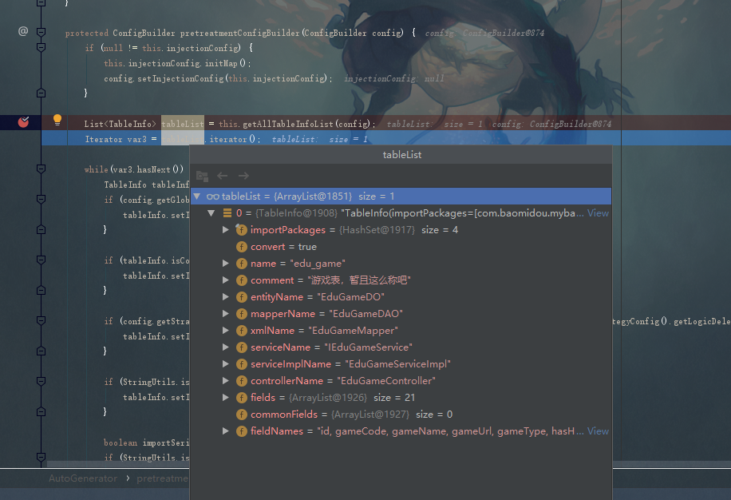

myBaitsPlus的代码生成器使用比较简单，在[官方文档](https://mp.baomidou.com/guide/generator.html)里都有说明，并且还提供了例子。  
根据例子，自己也写了一个代码生成类，随后发现了一个问题，这个会一次性生成controller、service、serviceImpl、mapper、mapperxml、entity。可是我不需要他生成controller，翻了翻官方文档并没有找到相应的提示，可能自己百度的方式不对，百度也没有给我答案，只能自己去查看源码了。
<!-- more -->
首先是我自己写的类
``` java 
public class Generator {
    public static void main(String[] args) {

        AutoGenerator generator = new AutoGenerator();

        // 全局配置
        GlobalConfig globalConfig = new GlobalConfig();
        globalConfig.setOutputDir(System.getProperty("user.dir") + "/src/main/java"); //生成文件的输出目录
        globalConfig.setFileOverride(true);//是否覆盖已有文件
        globalConfig.setAuthor("gqw");//开发人员
        globalConfig.setSwagger2(true);//开启 swagger2 模式
        globalConfig.setEntityName("%sDO");//实体命名方式
        globalConfig.setMapperName("%sDAO");//mapper 命名方式
        globalConfig.setXmlName("%sMapper");//Mapper xml 命名方式

        generator.setGlobalConfig(globalConfig);

        // 数据源配置
        DataSourceConfig dsc = new DataSourceConfig();
        dsc.setUrl("jdbc:mysql://10.0.1.15:3306/dawngamegxyd?useUnicode=true&serverTimezone=GMT&useSSL=false&characterEncoding=utf8");
        dsc.setDriverName("com.mysql.jdbc.Driver");
        dsc.setUsername("admin");
        dsc.setPassword("admin123");

        generator.setDataSource(dsc);

        // 包配置
        PackageConfig pc = new PackageConfig();
        pc.setModuleName("test");//父包模块名
        pc.setParent("com.li.springbootthymeleaf");//父包名
        pc.setEntity("domain");//Entity包名
        pc.setMapper("dao");//Mapper包名
        pc.setXml("mapper");//Mapper XML包名

        generator.setPackageInfo(pc);

        // 数据库表配置
        StrategyConfig strategy = new StrategyConfig();

        strategy.setNaming(NamingStrategy.underline_to_camel);//数据库表映射到实体的命名策略
        strategy.setColumnNaming(NamingStrategy.underline_to_camel);//数据库表字段映射到实体的命名策略, 未指定按照 naming 执行
        strategy.setTablePrefix(pc.getModuleName() + "_");//表前缀

        strategy.setInclude("edu_game");//需要包含的表名，允许正则表达式（与exclude二选一配置）
//        strategy.setExclude("");//需要排除的表名，允许正则表达式
        strategy.setEntityLombokModel(true);//【实体】是否为lombok模型（默认 false）
        strategy.setControllerMappingHyphenStyle(true);//驼峰转连字符

        generator.setStrategy(strategy);

        generator.execute();
    }
}
```
大部分都是配置，只有最后一行generator.execute()进入代码的生成。  
进入这个方法
```  java 
public void execute() {
    logger.debug("==========================准备生成文件...==========================");
    if (null == this.config) {
        this.config = new ConfigBuilder(this.packageInfo, this.dataSource, this.strategy, this.template, this.globalConfig);
        if (null != this.injectionConfig) {
            this.injectionConfig.setConfig(this.config);
        }
    }

    if (null == this.templateEngine) {
        this.templateEngine = new VelocityTemplateEngine();
    }

    this.templateEngine.init(this.pretreatmentConfigBuilder(this.config)).mkdirs().batchOutput().open();
    logger.debug("==========================文件生成完成！！！==========================");
}
```
config为之前写的各种配置。而生成文件的代码在`batchOutput()`中。
进入`batchOutput()`会发现有那么几行类似的代码
``` java 
if (null != tableInfo.getControllerName() && null != pathInfo.get("controller_path")) {
    controllerFile = String.format((String)pathInfo.get("controller_path") + File.separator + tableInfo.getControllerName() + this.suffixJavaOrKt(), entityName);
    if (this.isCreate(FileType.CONTROLLER, controllerFile)) {
        this.writer(objectMap, this.templateFilePath(template.getController()), controllerFile);
    }
}
```
这就是用来生成文件的代码。
从明面上看只要if中的条件为fasle就不会生成了,那么就要去看if中的条件中的参数是从哪里来的。  
首先是tableInfo.getControllerName()。
``` java 
TableInfo tableInfo = (TableInfo)var2.next();

Iterator var2 = tableInfoList.iterator();

List<TableInfo> tableInfoList = this.getConfigBuilder().getTableInfoList();
```
``` java 
public ConfigBuilder getConfigBuilder() {
    return this.configBuilder;
}
```
所以要看看configBuilder是从哪里来的。  
一步一步逆推上去。在AutoGenerator.execute()，也就是上面的execute()方法中， 有个templateEngine.init()
``` java 
public AbstractTemplateEngine init(ConfigBuilder configBuilder) {
    this.configBuilder = configBuilder;
    return this;
}
```
接下来就要看this.pretreatmentConfigBuilder(this.config)，这个东西就是configBuilder 。  
进入pretreatmentConfigBuilder方法,结合debug，发现

``` java 
protected List<TableInfo> getAllTableInfoList(ConfigBuilder config) {
    return config.getTableInfoList();
}
```
我们想要的controllerName早就存在于ConfigBuilder中。故我们直接去看看ConfigBuilder是怎么产生的。也就是AutoGenerator.execute()中的
``` java 
this.config = new ConfigBuilder(this.packageInfo, this.dataSource, this.strategy, this.template, this.globalConfig);
```
进入ConfigBuilder的构造函数,发现大部分都是对我们之前写的配置进行设置。  
结合debug，`tableInfoList`在`this.handlerStrategy(this.strategyConfig);`中生成
点进方法里，有一个`this.tableInfoList = this.getTablesInfo(config);`  
继续点进去。
有一长段的代码，但是在debug中看下来，这些是去循环记录了你数据库里的表。最终有用的还是得看最后的`this.processTable(includeTableList, config.getNaming(), config);`
在`processTable()`方法中，我们可以看到`tableInfo.setControllerName`
这就很明显了。`controllerName`就是在这里设置的，但是
``` java 
if (StringUtils.isNotEmpty(this.globalConfig.getControllerName())) {
    tableInfo.setControllerName(String.format(this.globalConfig.getControllerName(), entityName));
} else {
    tableInfo.setControllerName(entityName + "Controller");
}
```
这里面是一个if else语句，等于说不管怎样，controllerName都不会为空，`tableInfo.getControllerName()`这条路走不通了，那只能换一条`pathInfo.get("controller_path")`路走了。  
`pathInfo`也是`ConfigBuilder`中的，直接去看`ConfigBuilder`构造方法。  
可以明显的看出`pathInfo`在构造方法中的`handlerPackage()`产生。
``` java 
private void handlerPackage(TemplateConfig template, String outputDir, PackageConfig config) {
    this.packageInfo = new HashMap(8);
    this.packageInfo.put("ModuleName", config.getModuleName());
    this.packageInfo.put("Entity", this.joinPackage(config.getParent(), config.getEntity()));
    this.packageInfo.put("Mapper", this.joinPackage(config.getParent(), config.getMapper()));
    this.packageInfo.put("Xml", this.joinPackage(config.getParent(), config.getXml()));
    this.packageInfo.put("Service", this.joinPackage(config.getParent(), config.getService()));
    this.packageInfo.put("ServiceImpl", this.joinPackage(config.getParent(), config.getServiceImpl()));
    this.packageInfo.put("Controller", this.joinPackage(config.getParent(), config.getController()));
    Map<String, String> configPathInfo = config.getPathInfo();
    if (null != configPathInfo) {
        this.pathInfo = configPathInfo;
    } else {
        this.pathInfo = new HashMap(6);
        this.setPathInfo(this.pathInfo, template.getEntity(this.getGlobalConfig().isKotlin()), outputDir, "entity_path", "Entity");
        this.setPathInfo(this.pathInfo, template.getMapper(), outputDir, "mapper_path", "Mapper");
        this.setPathInfo(this.pathInfo, template.getXml(), outputDir, "xml_path", "Xml");
        this.setPathInfo(this.pathInfo, template.getService(), outputDir, "service_path", "Service");
        this.setPathInfo(this.pathInfo, template.getServiceImpl(), outputDir, "service_impl_path", "ServiceImpl");
        this.setPathInfo(this.pathInfo, template.getController(), outputDir, "controller_path", "Controller");
    }

}
```
debug发现，config.getPathInfo()为null。接下来就需要去看看这个东西可以在那里赋值。这里的config是PackageConfig，这就很明显了，就是我们自己的包配置PackageConfig。  
随后在我们的包配置里多增加一条配置，
``` java 
Map<String,String> pathInfo=new HashMap<String,String>();
pathInfo.put("entity_path",globalConfig.getOutputDir()+"/"+pc.getParent().replaceAll("\\.","/")+"/"+pc.getEntity().replaceAll("\\.","/"));//需要把.替换成/
//        pathInfo.put("mapper_path","");
//        pathInfo.put("xml_path","");
pc.setPathInfo(pathInfo);//路径配置信息
```
执行后果然只有一个Entity类了。