### 本章前提
- 了解vue
- 了解SpringBoot

### 本章内容
[前端代码](https://github.com/gqiwei/guai_ui/tree/lab-01)  
[后端代码](https://github.com/gqiwei/guai/tree/lab-01)  
创建后端项目，运行前端项目，以及数据互通。

# 创建sringboot项目
## 创建流程
1. 新建项目如下图，点击next。
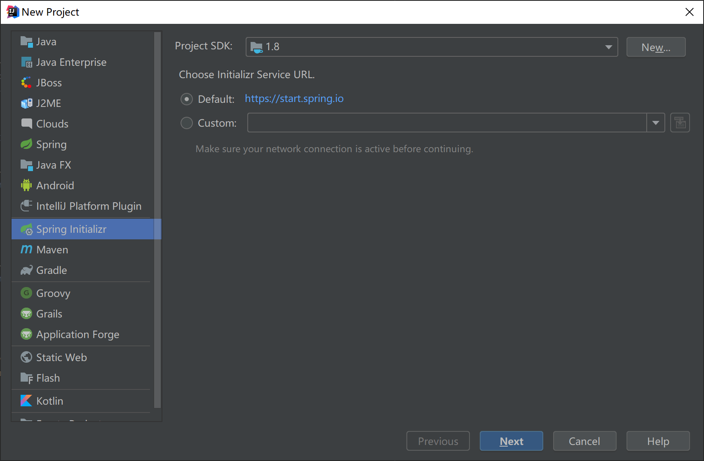
2. Group为包名,Artifact为项目名，填写完成点击next。如下图。
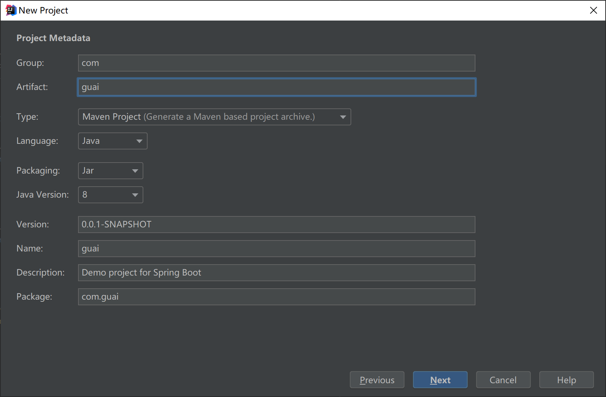
3. 勾选springWeb模板，点击next。如下图。
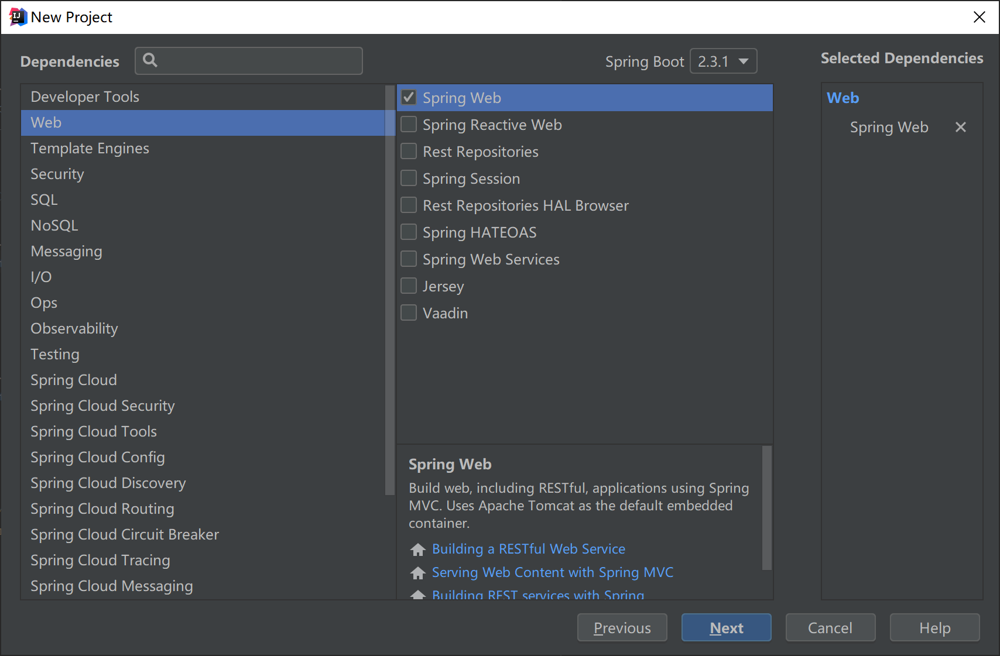
4.点击finish完成创建。如下图。
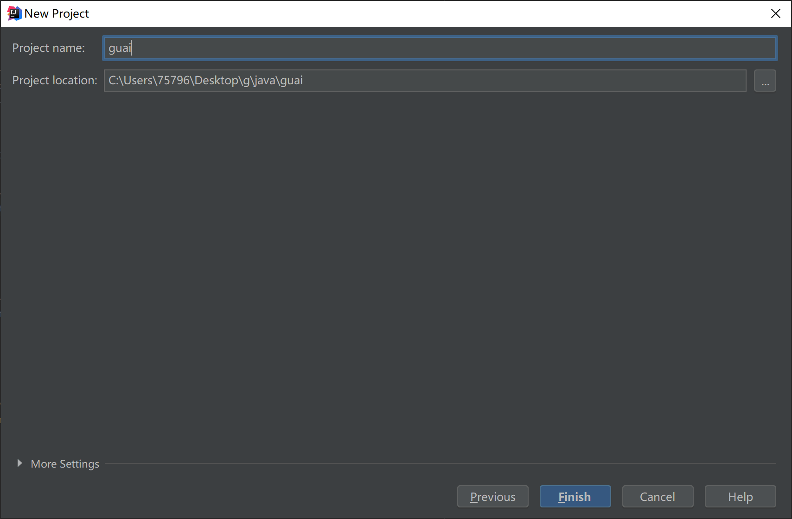

## 测试一下
创建一个`TestController.java`。
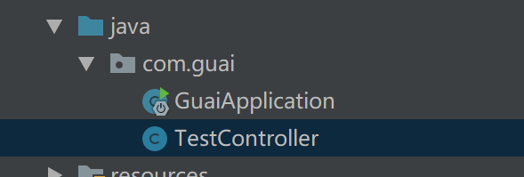

``` java 
package com.guai;

import org.springframework.web.bind.annotation.RequestMapping;
import org.springframework.web.bind.annotation.RestController;

@RestController
public class TestController {
    @RequestMapping("/test")
    public String test(){
        return "{code:200}";
    }
}

```
启动springboot,并访问`http://localhost:8080/test`,最终会出现如下结果：
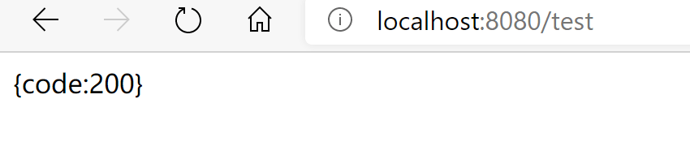

# 前端项目
前端项目采用的是[vue-element-admin](https://github.com/PanJiaChen/vue-element-admin)。  
vue-element-admin是有两个版本，一个集成方案，里面有很多功能的样例，另一个是基础模板，只保留了后台的基本功能。  
集成方案中会有很多用不到的功能，故采用基础模板[vue-admin-template](https://github.com/PanJiaChen/vue-admin-template)，之后后台需要什么功能，只需从vue-element-admin搬过来即可。

## 前提
需要提前安装node.js与git。
我的node与git版本如下：
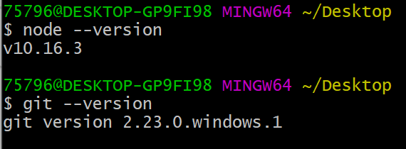
## 下载vue-admin-template
在本地项目文件夹里打开GitBash
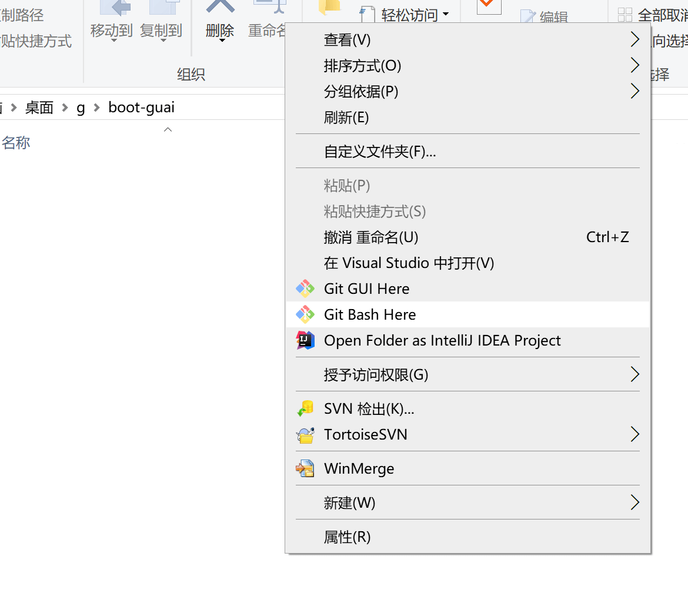
输入`git clone git@github.com:PanJiaChen/vue-admin-template.git`,将vue-admin-template克隆到本地。  

## 运行
输入`cd vue-admin-template/`进入文件夹。  
切换分支`git checkout permission-control`，此分支下是根据用户来生成侧边栏跟router。  
输入`npm install`安装依赖。若下载速度过慢，可先输入`npm install --registry=https://registry.npm.taobao.org`。    
在安装完依赖之后，输入`npm run dev`来启动。启动成功会自动弹出页面，如下：
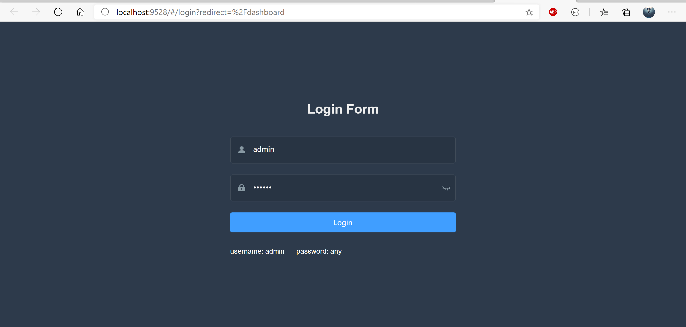

## 查看登录相关代码
登录页面在`src/views/loign/index.vue`。  
``` js
// index.vue 部分代码

//form表单
<el-form ref="loginForm" :model="loginForm" :rules="loginRules" class="login-form" auto-complete="on" label-position="left"> //(1)

//handleLogin
handleLogin() {
  this.$refs.loginForm.validate(valid => { //(2)
    if (valid) {
      this.loading = true
      this.$store.dispatch('user/login', this.loginForm).then(() => {
        this.$router.push({ path: this.redirect || '/' })
        this.loading = false
      }).catch(() => {
        this.loading = false
      })
    } else {
      console.log('error submit!!')
      return false
    }
  })
}

//loginRules
loginRules: {
  username: [{ required: true, trigger: 'blur', validator: validateUsername }],//(3)
  password: [{ required: true, trigger: 'blur', validator: validatePassword }]//(3)
}
//validateUsername
const validateUsername = (rule, value, callback) => {
  if (!validUsername(value)) {
    callback(new Error('Please enter the correct user name'))
  } else {
    callback()
  }
}
//validatePassword
const validatePassword = (rule, value, callback) => {
  if (value.length < 6) {
    callback(new Error('The password can not be less than 6 digits'))
  } else {
    callback()
  }
}


```
(1) 表单验证规则为`loginRules()`。  
(2) 点击登录会进行表单校验，登录接口请求将会写在此处。  
(3) `required: true` 表示参数必填，`trigger`表示在失去焦点触发。`validator`表示失焦时会去触发的方法。

## 更改原有的登录
`vue-admin-template`中本身的数据交互是用`mock`，所以要删除`mock`，更换成我们自己的服务。  
打开`vue.config.js`，删除`before: require('./mock/mock-server.js')`，并给`devServer`添加`proxy`，`proxy`是为了解决等下接口访问跨域的问题。
``` js
devServer: {
  port: port,
  open: true,
  overlay: {
    warnings: false,
    errors: true
  },
  proxy: {
    "/": {   //所有请求转发
      target:"http://localhost:8080"
    }
  }
}
```
因为我们目前使用的是dev环境，所以还要修改`.env.development`中的`VUE_APP_BASE_API`。
```
VUE_APP_BASE_API = ''
```
最后修改请求接口名，`scr/api/user.js`，将url中的`/vue-admin-template`删除。 
至此前端部分就修改好了。接下来就要编写下后端接口。
在`pom.xml`添加`fastjson`的依赖。
``` xml
<dependency>
  <groupId>com.alibaba</groupId>
  <artifactId>fastjson</artifactId>
  <version>1.2.13</version>
</dependency>
```
打开`TestController.java`,添加新的登录接口和获取用户信息接口。
``` java
@RequestMapping("user/login")
public Map login(@RequestBody JSONObject body){
    System.out.println(body.toJSONString());
    Map<String,Object> result = new HashMap<String,Object>();
    Map<String,Object> data = new HashMap<String,Object>();
    data.put("token","123123123");//token 暂时随便写写
    result.put("data",data);
    result.put("code",20000);
    return result;
}

@RequestMapping("user/info")
public Map info(){
    Map<String,Object> data = new HashMap<String,Object>();
    data.put("roles","admin");
    data.put("introduction","I am a super administrator");
    data.put("avatar","https://wpimg.wallstcn.com/f778738c-e4f8-4870-b634-56703b4acafe.gif");
    data.put("name","Super Admin");
    Map<String,Object> result = new HashMap<String,Object>();
    result.put("data",data);
    result.put("code",20000);
    return result;
}
```
因为当前前端分支会在登录后去获取用户信息，故多加了`user/info`接口。
启动springboot服务与前端服务，进入登录页面点击登录即可成功。
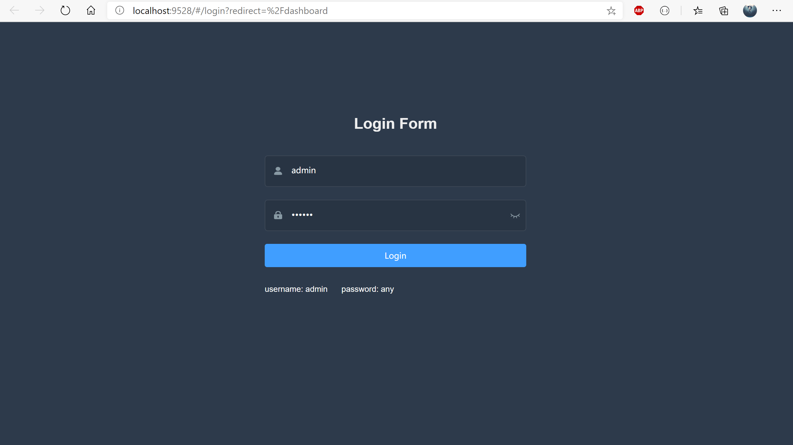
登录后，后端控制台打印：
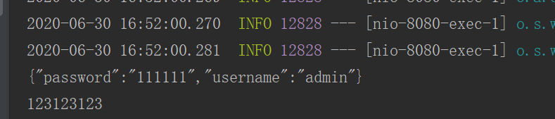
登录后页面：
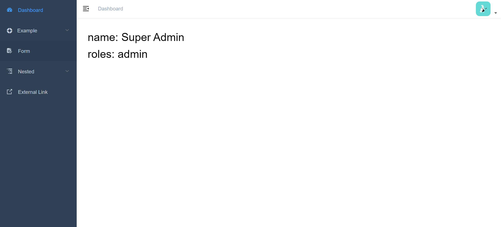


# 结束语
此篇章只是运行程序以及打通数据，还是很简单的，下一章就是给后端创建基本的雏形。

