### 本章前提
- 了解logback
- 了解swagger
- 了解xss攻击
- 了解druid
- 了解mybatis

### 本章内容
[代码](https://github.com/gqiwei/guai/tree/lab-02)  
日志配置、全局异常捕获、swagger配置、xss过滤、druid与mybatis配置。


# 基本目录创建
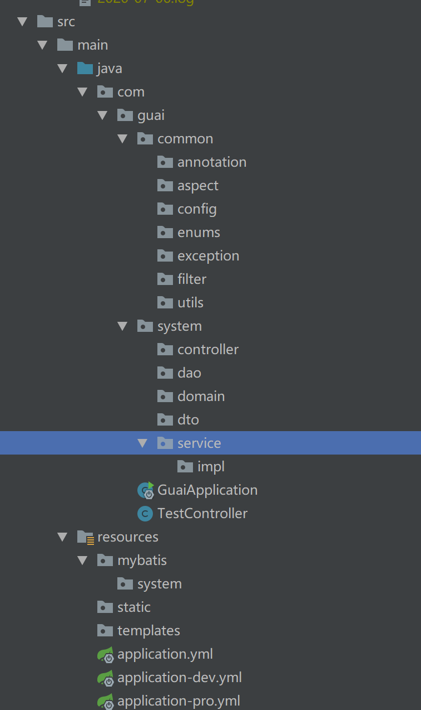
各个包名就是字面上的意思。还有的是，`application.yml`为配置文件，与`application.properties`，个人偏好于.yml格式的文件。
# 日志
springboot默认使用logback日志。
## 基本配置
在resources下创建`logback-spring.xml`。  
`logback-spring.xml`会自动被springboot加载。
``` xml
<?xml version="1.0" encoding="UTF-8"?>
<configuration debug="false">
    <appender name="console" class="ch.qos.logback.core.ConsoleAppender">
        <encoder class="ch.qos.logback.classic.encoder.PatternLayoutEncoder">
            <!--格式化输出：%d表示日期，%thread表示线程名，%-5level：级别从左显示5个字符宽度，%logger{50}：logger名字长度50，%msg：日志消息，%n是换行符-->
            <pattern>%d{HH:mm:ss} [%thread] %-5level %logger{50} - %msg%n</pattern>
            <!--设置编码-->
            <charset>UTF-8</charset>
        </encoder>
    </appender>
    <appender name="file" class="ch.qos.logback.core.rolling.RollingFileAppender">
        <rollingPolicy class="ch.qos.logback.core.rolling.TimeBasedRollingPolicy">
            <!-- 文件名格式 -->
            <FileNamePattern>
                log/%d{yyyy-MM-dd}/%d{yyyy-MM-dd}.log
            </FileNamePattern>
        </rollingPolicy>
        <layout class="ch.qos.logback.classic.PatternLayout">
            <Pattern>
                %d{yyyy-MM-dd HH:mm:ss} -%msg%n
            </Pattern>
        </layout>
    </appender>

    <!-- com.guai下的打印是DEBUG -->
    <logger name="com.guai" level="DEBUG" />
    <!-- INFO级别打印 -->
    <root level="INFO">
        <appender-ref ref="console"/>
        <appender-ref ref="file" />
    </root>
</configuration>
```
配置好后，启动项目后会按照配置文件里的格式打印日志，最后也会生成日志文件。
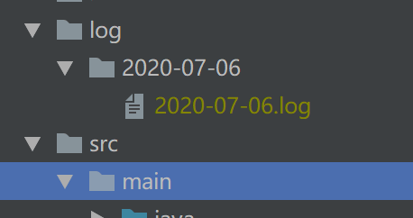
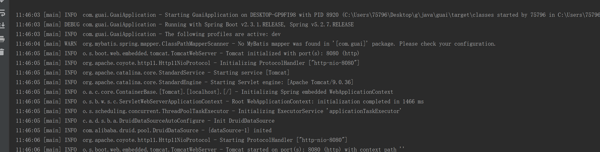

# 响应信息主体
## 添加pom依赖
``` xml
<!--lombok-->
<dependency>
    <groupId>org.projectlombok</groupId>
    <artifactId>lombok</artifactId>
    <optional>true</optional>
</dependency>
```
## 定义返回状态码枚举
在`com.guai.common.enums`下创建`ResultEnum.java`。
``` java
@Getter
public enum ResultEnum {
    SUCCESS(0,"成功"),
    FAIL(1,"失败"),
    ;

    private int code ;
    private String message;

    ResultEnum(int code,String message){
        this.code=code;
        this.message=message;
    }
}
```
其中的状态码code可以自定义。
## 封装响应消息主体
在`com.guai.common.utils`下创建`R.java`。
``` java
@Data
public class R<T> implements Serializable {

    private static final long serialVersionUID = 1L;

    private int code;
    private String message;
    private T data;


    public R(){
        this(ResultEnum.SUCCESS,"success");
    }

    public R(T t){
        this(ResultEnum.SUCCESS,"success",t);
    }

    public R(ResultEnum e, String message){
        this(e,message,null);
    }

    public R(ResultEnum e ,String message,T data){
        this.code = e.getCode();
        this.data = data;
        this.message= message;
    }

    public static <T> R ok(){
        return  new R();
    }

    public static <T> R ok(T data){
        return new R(data);
    }

    public static <T> R oke(String message){
        return new R(ResultEnum.SUCCESS,message);
    }

    public static <T> R error(){
        return new R(ResultEnum.FAIL,"error");
    }

    public static <T> R error(String message){
        return new R(ResultEnum.FAIL,message);
    }

    public static <T> R error(T data){
        return new R(ResultEnum.FAIL,"error",data);
    }

    public static <T> R error(String message,T data){
        return new R(ResultEnum.FAIL,message,data);
    }


    public static <T> R result(ResultEnum e,String message){
        return new R(e,message);
    }

    public static <T> R result(ResultEnum e,String message,T data){
        return new R(e,message,data);
    }
}
```
虽然上面定义了很多方法，但实际常用的就`ok()`、`ok(T data)`、`error()`。
## 测试
在`TestController.java`中添加新的接口。
``` java
@RequestMapping("/r")
public R r(String some){
    return R.ok(some);
}
```
启动服务访问接口`http://localhost:8080/r?some=abcd`。
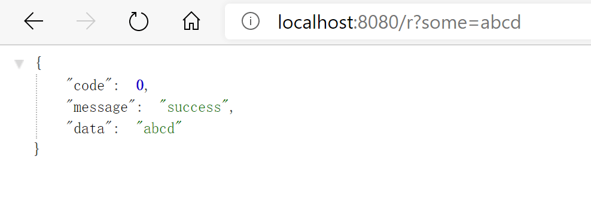

# 全局异常捕获
在`com.guai.common.exception`下创建`GlobalExceptionHandler.java`。
``` java
@RestControllerAdvice
public class GlobalExceptionHandler {
    private static final Logger LOG = LoggerFactory.getLogger(GlobalExceptionHandler.class);

    @ExceptionHandler(Exception.class)
    public R handleException(Exception e) {
        LOG.error(e.getMessage(), e);
        return R.error(e.getMessage());
    }
}
```
在`TestController.java`中添加新的接口。
``` java
@RequestMapping("ex")
public R r() throws Exception {
    throw new Exception("错误信息");
}
```
重启服务访问接口`http://localhost:8080/ex`。
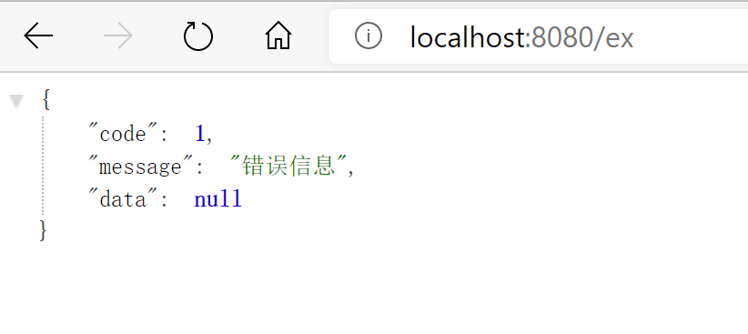

在访问一个不存在的接口时，springboot有自己默认的处理页，如下。
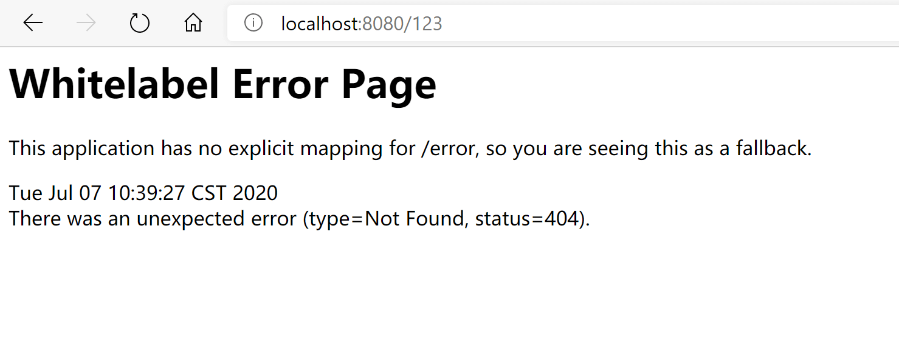
这个目前是无法被全局异常捕获，要做以下修改。  
在`application.yml`中添加
``` yml
spring: 
  mvc:
    throw-exception-if-no-handler-found: true
  resources:
    add-mappings: false
```
这个添加之后，异常就可以捕获到了。
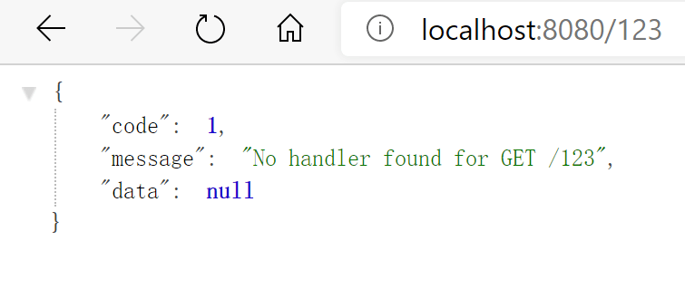
为了与`Exception.class`区分，在`GlobalExceptionHandler`中添加`NoHandlerFoundException.class`的异常捕获。
``` java
@ExceptionHandler(NoHandlerFoundException.class)
public R handlerNoFoundException(Exception e)
{
    LOG.error(e.getMessage(), e);
    return R.error("路径不存在");
}
```
再次访问不存在的接口。
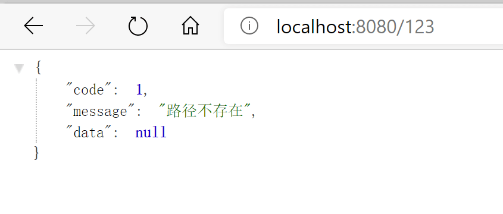
有一个注意事项，添加`spring.mvc.throw-exception-if-no-handler-found=true`与`spring.resources.add-mappings=false`之后，项目中的静态文件访问将会出问题，在下面使用swagger的时候会有解决方案。
# api文档
## swagger
### 添加pom依赖
``` xml
<dependency>
    <groupId>io.springfox</groupId>
    <artifactId>springfox-swagger2</artifactId>
    <version>2.6.1</version>
</dependency>
<dependency>
    <groupId>io.springfox</groupId>
    <artifactId>springfox-swagger-ui</artifactId>
    <version>2.6.1</version>
</dependency>
```
### 添加配置
在`com.guai.common.config`下创建`Swagger2Config`。
``` java
@EnableSwagger2
@Configuration
public class Swagger2Config {
    @Bean
    public Docket createRestApi() {
        return new Docket(DocumentationType.SWAGGER_2)
                .apiInfo(apiInfo())
                .select()
                //为当前包路径
                .apis(RequestHandlerSelectors.any())
                .paths(Predicates.not(PathSelectors.regex("/error.*")))// 错误路径不监控
                .paths(PathSelectors.any())
                .build();
    }

    //构建 api文档的详细信息函数
    private ApiInfo apiInfo() {
        return new ApiInfoBuilder()
                //页面标题
                .title("功能测试")
                //创建人
                .contact(new Contact("小怪", "http://blog.lsiru.com", "gqiwei163@.com"))
                //版本号
                .version("1.0")
                //描述
                .description("API 描述")
                .build();
    }
}
```
因为swagger页面是静态文件，之前又做全局异常捕获，要做下处理。在`com.guai.common.config`下创建`ResourcesConfig`。
``` java
@Configuration
public class ResourcesConfig implements WebMvcConfigurer {
    @Override
    public void addResourceHandlers(ResourceHandlerRegistry registry)
    {
        /** swagger配置 */
        registry.addResourceHandler("swagger-ui.html").addResourceLocations("classpath:/META-INF/resources/");
        registry.addResourceHandler("/webjars/**").addResourceLocations("classpath:/META-INF/resources/webjars/");
    }
}
```
### 简单测试
启动服务器，访问`http://localhost:8080/swagger-ui.html`。
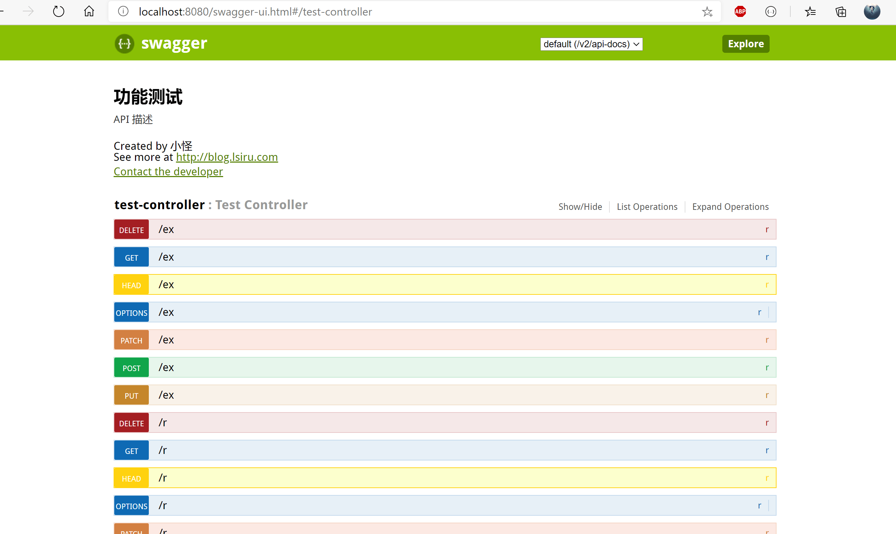
之所以有这么多个接口，是因为我们使用了`@RequestMapping()`注解，会加载所有的method。规定method之后就会只存在你设置的method，如`@RequestMapping(value ="/xxx",method = RequestMethod.POST)`、`@PostMapping("/xxx")`。
## UI
使用swagger自己的页面，觉得太丑，不好用，可以使用另一个ui——[swagger-bootstrap-ui](https://github.com/liukaixiong/Swagger-Bootstrap-UI)。
### 添加依赖
``` xml
<dependency>
    <groupId>com.github.xiaoymin</groupId>
    <artifactId>swagger-bootstrap-ui</artifactId>
    <version>1.9.3</version>
</dependency>
```
### 修改ResourcesConfig
在`addResourceHandlers(ResourceHandlerRegistry registry)`里添加`registry.addResourceHandler("doc.html").addResourceLocations("classpath:/META-INF/resources/");`。
### 简单测试
启动服务器，访问`http://localhost:8080/doc.html`。
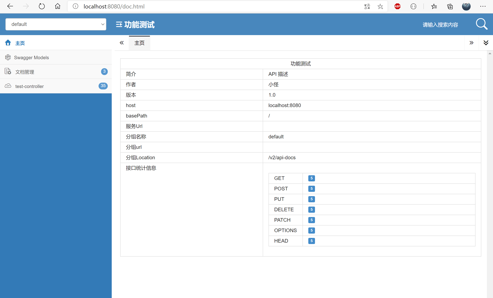
## 测试
后续会采用swagger-bootstrap-ui，故swagger-ui在之后篇章中会被删除。
### 给R.java添加注解
``` java
@Data
@ApiModel(value="响应消息主体", description="接口返回对象")
public class R<T> implements Serializable {

    private static final long serialVersionUID = 1L;
    
    @ApiModelProperty(value = "返回状态码；标准来自ResultEnum类")
    private int code;
    @ApiModelProperty(value = "返回状态信息")
    private String message;
    @ApiModelProperty(value = "返回的数据对象")
    private T data;

    ....
}
```
### 创建TestDO
``` java
@Data
@ApiModel(value="测试数据对象", description="测试数据")
public class TestDO {
    @ApiModelProperty(value = "名字")
    private String name;
    @ApiModelProperty(value = "年龄")
    private Integer age;
}
```
### 修改TestController
``` java
@Api(value = "测试内容",tags="测试")
@RestController
public class TestController {

    @ApiOperation(value="测试接口",notes = "测试接口访问")
    @GetMapping("/test")
    public String test(){
        return "{code:200}";
    }

    @ApiOperation(value="登录",notes = "登录")
    @ApiImplicitParam(name = "body",value = "登录信息" ,required = true,paramType = "body")
    @PostMapping("user/login")
    public Map login(@RequestBody JSONObject body){
        System.out.println(body.toJSONString());
        Map<String,Object> result = new HashMap<String,Object>();
        Map<String,Object> data = new HashMap<String,Object>();
        data.put("token","123123123");//token 暂时随便写写
        result.put("data",data);
        result.put("code",20000);
        return result;
    }

    @ApiOperation(value="获取用户信息",notes = "获取用户信息")
    @ApiImplicitParam(name = "token",value = "用户token" ,required = true,paramType = "query")
    @GetMapping("user/info")
    public Map info(String token){
        System.out.println(token);
        Map<String,Object> data = new HashMap<String,Object>();
        data.put("roles","admin");
        data.put("introduction","I am a super administrator");
        data.put("avatar","https://wpimg.wallstcn.com/f778738c-e4f8-4870-b634-56703b4acafe.gif");
        data.put("name","Super Admin");
        Map<String,Object> result = new HashMap<String,Object>();
        result.put("data",data);
        result.put("code",20000);
        return result;
    }

    @ApiOperation(value="响应消息主体测试",notes = "测试接口访问")
    @GetMapping("/r")
    public R r(String some){
        return R.ok(some);
    }

    @ApiOperation(value="全局异常捕获",notes = "测试接口访问")
    @GetMapping("ex")
    public R r() throws Exception {
        throw new Exception("错误信息");
    }

    @ApiOperation(value="swagger接口测试",notes = "测试接口访问")
    @GetMapping("sw")
    public R<TestDO> swagger(){
        TestDO t = new TestDO();
        t.setAge(10);
        t.setName("张三");
        return R.ok(t);
    }
}
```
启动服务器，访问`http://localhost:8080/doc.html`，查看swagger接口测试，参数所有备注都能查看。
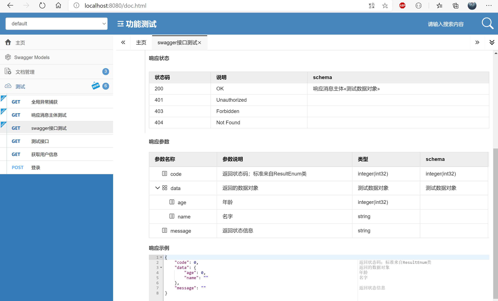


# 添加xss过滤器
xss过滤器主要处理请求中的html代码，防止xss攻击，这里采用Jsoup来处理。
## 代码编写
### 添加pom依赖
``` xml
<dependency>
    <groupId>org.apache.commons</groupId>
    <artifactId>commons-lang3</artifactId>
    <version>3.6</version>
</dependency>

<dependency>
    <groupId>org.jsoup</groupId>
    <artifactId>jsoup</artifactId>
    <version>1.9.2</version>
</dependency>
```
### 创建JsoupUtil.java
在`com.guai.common.utils`下创建`JsoupUtil.java`，主要是处理html。代码如下：
``` java 
public class JsoupUtil {
    /**
     * 使用自带的 basicWithImages 白名单
     * 允许的便签有 a,b,blockquote,br,cite,code,dd,dl,dt,em,i,li,ol,p,pre,q,small,span,strike,strong,sub,sup,u,ul,img
     * 以及 a 标签的 href,img 标签的 src,align,alt,height,width,title 属性
     */
    private static final Whitelist whitelist = Whitelist.basicWithImages();
    /** 配置过滤化参数, 不对代码进行格式化 */
    private static final Document.OutputSettings outputSettings = new Document.OutputSettings().prettyPrint(false);
    static {
        // 富文本编辑时一些样式是使用 style 来进行实现的
        // 比如红色字体 style="color:red;"
        // 所以需要给所有标签添加 style 属性
        whitelist.addAttributes(":all", "style");
    }
    public static String clean(String content) {
        return Jsoup.clean(content, "", whitelist, outputSettings);
    }
}
```
### 创建XssHttpServletRequestWrapper.java
在`com.guai.common.filter`下创建`XssHttpServletRequestWrapper.java`。
``` java
public class XssHttpServletRequestWrapper extends HttpServletRequestWrapper {

    public XssHttpServletRequestWrapper(HttpServletRequest request) {
        super(request);
    }

    @Override
    public String getParameter(String name) {
        name = JsoupUtil.clean(name);
        String value = super.getParameter(name);
        if (StringUtils.isNotBlank(value)) {
            value = JsoupUtil.clean(value);
        }
        return value;
    }

    @Override
    public String[] getParameterValues(String name) {
        String[] arr = super.getParameterValues(name);
        if(arr != null){
            for (int i=0;i<arr.length;i++) {
                arr[i] = JsoupUtil.clean(arr[i]);
            }
        }
        return arr;
    }

    @Override
    public String getHeader(String name) {
        name = JsoupUtil.clean(name);
        String value = super.getHeader(name);
        if (StringUtils.isNotBlank(value)) {
            value = JsoupUtil.clean(value);
        }
        return value;
    }
}
```
重写`getParameter（String name)`、`getParameterValues(String name)`、`getHeader(String name)`，将请求参数全都做xss过滤。

### 创建XssFilter.java
在`com.guai.common.filter`下创建`XssFilter.java`。
``` java
public class XssFilter implements Filter {

    public List<String> excludes = new ArrayList<String>();
    @Override
    public void init(FilterConfig filterConfig) throws ServletException {
        String temp = filterConfig.getInitParameter("excludes");
        if(temp != null){
            String[] url = temp.split(",");
            for(int i=0;url!=null && i<url.length;i++){
               if(!"".equals(url[i])){
                    excludes.add(url[i]); //添加白名单
                }
            }
        }
    }

    @Override
    public void doFilter(ServletRequest servletRequest, ServletResponse servletResponse, FilterChain filterChain) throws IOException, ServletException {
        HttpServletRequest request = (HttpServletRequest) servletRequest;
        HttpServletResponse response = (HttpServletResponse) servletResponse;
        if(handleExcludeURL(request,response)){
            filterChain.doFilter(request,response);
            return ;
        }

        XssHttpServletRequestWrapper xssRequest = new XssHttpServletRequestWrapper(request);
        filterChain.doFilter(xssRequest,response);
    }

    /**
     * 判断连接是否在白名单里
     * @param request
     * @param response
     * @return
     */
    public boolean handleExcludeURL(HttpServletRequest request, HttpServletResponse response){
        if(excludes.isEmpty()||excludes ==null){
            return false;
        }

        String url = request.getServletPath();
        for(String pattern : excludes){
            Pattern p = Pattern.compile("^"+pattern);
            Matcher m = p.matcher(url);
            if(m.find()){
                return true;
            }
        }
        return false;
    }

    @Override
    public void destroy() {

    }
}
```
### 创建FilterConfig.java
在`com.guai.common.config`下创建`FilterConfig.java`。
``` java
@Configuration
public class FilterConfig {

    @Bean
    public FilterRegistrationBean xssFilterRegistrationBean(){
        FilterRegistrationBean filterRegistrationBean = new FilterRegistrationBean();
        filterRegistrationBean.setFilter(new XssFilter());
        filterRegistrationBean.setOrder(1);//优先级  越小代表优先级越高
        filterRegistrationBean.setEnabled(true);//是否开启
        filterRegistrationBean.addUrlPatterns("/*");

        Map<String,String> initParameters = new HashMap<String,String>();
        initParameters.put("excludes","");//白名单，  多个以逗号相隔
        filterRegistrationBean.setInitParameters(initParameters);

        return filterRegistrationBean;

    }
}
```
至此xss过滤器就已经处理完了，接下来就是测试了。

## 测试
`TestController.java`中添加接口。
``` java
@GetMapping("xss")
public R xss(String url){
    return R.ok(url);
}
```
启动服务器，然后在浏览器中访问`http://localhost:8080/xss?url=<script>alert(1)</script>测试`。
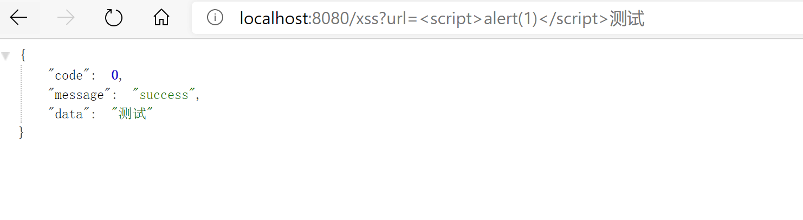
xss过滤成功。对于xss攻击，完全可以自己视情况在`XssHttpServletRequestWrapper.java`中自定义处理方式。

# 数据库连接
## 添加pom依赖
``` xml
<!-- druid -->
<dependency>
    <groupId>com.alibaba</groupId>
    <artifactId>druid-spring-boot-starter</artifactId>
    <version>1.1.17</version>
</dependency>
<!-- mybatis -->
<dependency>
    <groupId>org.mybatis.spring.boot</groupId>
    <artifactId>mybatis-spring-boot-starter</artifactId>
    <version>2.1.0</version>
</dependency>
<dependency>
    <groupId>mysql</groupId>
    <artifactId>mysql-connector-java</artifactId>
    <version>8.0.20</version>
</dependency>
```
## 连接池druid配置
[druid](https://github.com/alibaba/druid/)是Java语言中最好的数据库连接池。提供强大的监控和扩展功能。

### 配置文件
在`application.yml`中添加
``` yml
#读取application-dev.yml 配置文件 测试环境dev、生产环境pro
spring:
  profiles:
    active: dev 
```
在`application-dev.yml`中添加
``` yml
spring:
  datasource:
    druid:
      url: jdbc:mysql://localhost:3306/life?useUnicode=true&characterEncoding=utf8
      username: root
      password: 123456789
      #WebStatFilter
      web-stat-filter:
        enabled: true
        profile-enable: true
        url-pattern: /*
      #StatViewServlet
      stat-view-servlet:
        enabled: true
      initial-size: 1
      min-idle: 3
      max-active: 20

      #配置获取连接等待超时时间
      max-wait: 60000
      #配置间隔多久才进行一次检测，检测需要关闭的空闲连接，单位是毫秒
      time-between-eviction-runs-millis: 60000
      # 配置一个连接在池中最小生存的时间，单位是毫秒
      min-evictable-idle-time-millis: 30000
      #让连接池知道数据库已经断开了，并且自动测试连接查询
      validation-query: select 'x'
      test-while-idle: true
      test-on-borrow: false
      test-on-return: false

      filter:
        stat:
          enabled: true
          #开启慢查询
          log-slow-sql: true
          slow-sql-millis: 2000
          #合并sql
          merge-sql: true
        wall:
          enabled: true

```
更多的配置详情请访问[https://github.com/alibaba/druid/](https://github.com/alibaba/druid/)。

### druid测试
启动服务，访问`http://localhost:8080/druid/index.html`。
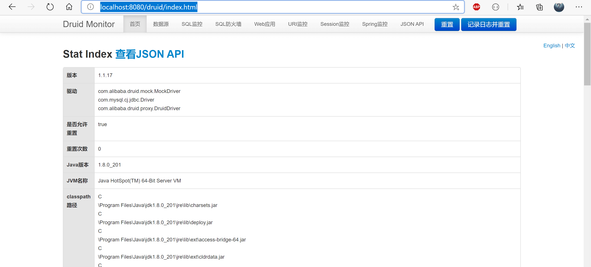

## mybaits
### 配置修改
在`application.yml`添加
``` yml
mybatis:
  #扫描mapper.xml路径
  mapper-locations: /mybatis/**/*.xml
  configuration:
    #开启驼峰原则
    map-underscore-to-camel-case: true
```
在启动类`GuaiApplication.java`添加注解`@MapperScan("com.guai.*.dao")`开启扫描。

### 测试
测试sql使用注解的形式，之后将会写在xml文件中。  
在`com.guai.system.dao`下创建`TestDAO.java`，其中表life_plan可以换成自己库里其他随意一张表。
``` java
@Mapper
public interface TestDAO {
    @Select("select count(*) from life_plan")
    public int select();
}
```
修改`TestController.java`。
``` java
public class TestController {
    @Autowired
    private TestDAO testDAO;

    ...

    @GetMapping("mybatis")
    public R mybatis(){
        return R.ok(testDAO.select());
    }
}
```
启动服务访问接口`http://localhost:8080/mybatis`。
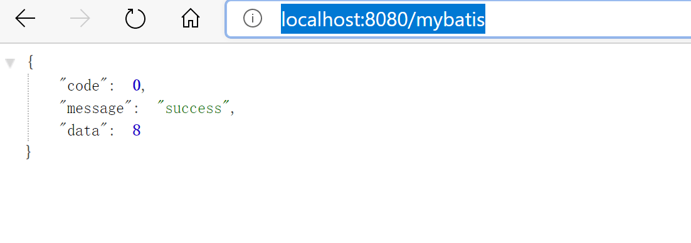
此时再去访问druid的监控网址，进入SQL监控和SQL防火墙已经有了数据。
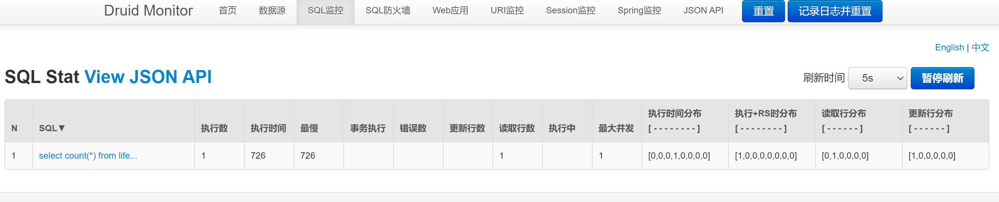
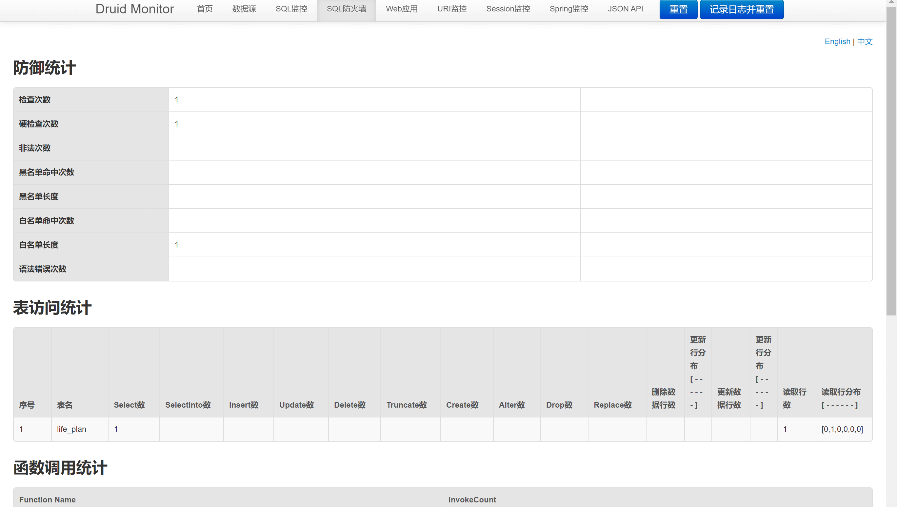

# 本章结语
本章感觉乱乱的。下章开始安全管理框架的配置。

