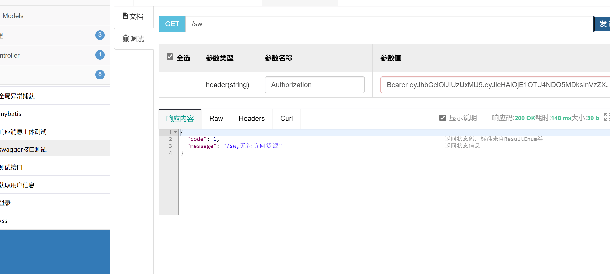

### 本章前提
- 了解vue
- 了解SpringBoot
- 了解Spring Security

### 本章内容
为什么从shiro改用了Spring Security，原因是要多多学习新的东西 ╮(๑•́ ₃•̀๑)╭。
[前端代码](https://github.com/gqiwei/guai_ui/tree/lab-03)  
[后端代码](https://github.com/gqiwei/guai/tree/lab-03)  


# 权限表设计
基于RBAC权限模型设计表。
- sys_user 用户表
- sys_role 角色表
- sys_user_role 用户与角色关联表
- sys_menu 菜单表
- sys_role_menu 角色与菜单关联表

## sys_user
用户表中的字段是根据具体需求来定的，目前暂定为：
``` sql
CREATE TABLE `sys_user` (
  `user_id` bigint(20) NOT NULL AUTO_INCREMENT,
  `user_name` varchar(50) NOT NULL COMMENT '用户名',
  `password` varchar(256) NOT NULL COMMENT '密码',
  `nick_name` varchar(50) DEFAULT NULL COMMENT '用户昵称',
  `sex` tinyint(1) DEFAULT NULL COMMENT '性别',
  `birth` datetime DEFAULT NULL COMMENT '出身日期',
  `pic` varchar(100) DEFAULT NULL COMMENT '头像',
  `dept_id` bigint(20) DEFAULT NULL COMMENT '部门',
  `email` varchar(50) DEFAULT NULL COMMENT '邮箱',
  `mobile` varchar(11) DEFAULT NULL COMMENT '手机号',
  `status` tinyint(1) DEFAULT '1' COMMENT '状态 0:禁用，1:正常',
  `is_del` tinyint(1) DEFAULT '0' COMMENT '是否被删除  0 未删除  1删除',
  `user_id_create` bigint(20) DEFAULT NULL COMMENT '创建用户id',
  `gmt_create` datetime DEFAULT NULL COMMENT '创建时间',
  `gmt_modified` datetime DEFAULT NULL COMMENT '修改时间',
  PRIMARY KEY (`user_id`)
) ENGINE=InnoDB DEFAULT CHARSET=utf8mb4 COMMENT='用户信息表';
```
## sys_role
角色表，没啥好说的。
``` sql
CREATE TABLE `sys_role` (
  `role_id` bigint(20) NOT NULL AUTO_INCREMENT,
  `role_name` varchar(100) DEFAULT NULL COMMENT '角色名称',
  `role_code` varchar(100) DEFAULT NULL COMMENT '角色标识',
  `remark` varchar(100) DEFAULT NULL COMMENT '备注',
  `is_del` tinyint(1) DEFAULT '0' COMMENT '是否被删除 1：删除 0未删除',
  `user_id_create` bigint(255) DEFAULT NULL COMMENT '创建用户id',
  `gmt_create` datetime DEFAULT NULL COMMENT '创建时间',
  `gmt_modified` datetime DEFAULT NULL COMMENT '创建时间',
  PRIMARY KEY (`role_id`)
) ENGINE=InnoDB DEFAULT CHARSET=utf8mb4 COMMENT='角色表';
```
## sys_user_role
``` sql
CREATE TABLE `sys_user_role` (
  `id` bigint(20) NOT NULL AUTO_INCREMENT,
  `user_id` bigint(20) DEFAULT NULL COMMENT '用户ID',
  `role_id` bigint(20) DEFAULT NULL COMMENT '角色ID',
  PRIMARY KEY (`id`)
) ENGINE=InnoDB DEFAULT CHARSET=utf8mb4 COMMENT='用户与角色关联表';
```
## sys_menu
与没有前后端分离的后台不同的是，多出`path`和`component`，用作于`vue`的路由。
``` sql
CREATE TABLE `sys_menu` (
  `menu_id` bigint(20) NOT NULL AUTO_INCREMENT COMMENT '菜单ID',
  `menu_name` varchar(50) NOT NULL COMMENT '菜单名称',
  `parent_id` bigint(20) DEFAULT '0' COMMENT '父菜单ID',
  `order_num` int(4) DEFAULT '0' COMMENT '排序',
  `path` varchar(128) DEFAULT '' COMMENT '路由地址',
  `component` varchar(255) DEFAULT NULL COMMENT '组件路径',
  `is_frame` tinyint(1) DEFAULT '1' COMMENT '是否为外链（0是 1否）',
  `type` tinyint(1) DEFAULT NULL COMMENT '类型   0：目录   1：菜单   2：按钮',
  `perms` varchar(128) DEFAULT NULL COMMENT '权限标识',
  `status` tinyint(1) DEFAULT '1' COMMENT '菜单状态（1正常 0停用）',
  `icon` varchar(32) DEFAULT NULL COMMENT '菜单图标',
  `gmt_create` datetime DEFAULT NULL COMMENT '创建时间',
  `gmt_modified` datetime DEFAULT NULL COMMENT '修改时间',
  PRIMARY KEY (`menu_id`)
) ENGINE=InnoDB DEFAULT CHARSET=utf8mb4 COMMENT='菜单权限表';
```
## sys_role_menu
``` sql
CREATE TABLE `sys_role_menu` (
  `id` bigint(20) NOT NULL AUTO_INCREMENT,
  `role_id` bigint(20) NOT NULL COMMENT '角色ID',
  `menu_id` bigint(20) NOT NULL COMMENT '菜单ID',
  PRIMARY KEY (`id`)
) ENGINE=InnoDB DEFAULT CHARSET=utf8mb4 COMMENT='角色与菜单关联表';
```
# 预先准备
大致画了时序图。
  
目前主要是登录这块，预先创建好文件以及sql。


`domain`下的类是对应表的实体类。
``` java
public interface SysUserDao {
    SysUser selectUserByUserName(String userName);
}
```
``` java
public interface SysMenuDao {
    List<String> selectPermsByUserId(Integer userId);
}
```
``` xml
<!--SysUserMapper.xml-->
<mapper namespace="com.guai.system.dao.SysUserDao">
    <select id="selectUserByUserName" resultType="com.guai.system.domain.SysUser">
        select user_id,user_name,password,nick_name,sex,birth,pic,dept_id,email,mobile,status,user_id_create,gmt_create,gmt_modified
        from sys_user where user_name = #{userNmae} and is_del = 0
    </select>
</mapper>
```
``` xml
<!--SysMenuMapper.xml-->
<mapper namespace="com.guai.system.dao.SysMenuDao">
    <select id="selectPermsByUserId" resultType="java.lang.String">
        select distinct t1.perms
		from sys_menu t1
			 left join sys_role_menu t2 on t1.menu_id = t2.menu_id
			 left join sys_user_role t3 on t2.role_id = t3.role_id
			 left join sys_role t4 on t4.role_id = t3.role_id
		where t1.status = '1' and t4.is_del = '0' and t3.user_id = #{userId}
    </select>
</mapper>
```
``` java 
@Service
public class SysMenuServiceImpl implements ISysMenuService {
    @Autowired
    private SysMenuDao sysMenuDao;

    @Override
    public List<String> selectPermsByUserId(Integer userId) {
        return sysMenuDao.selectPermsByUserId(userId);
    }
}
```
``` java
@Service
public class SysUserServiceImpl implements ISysUserService {
    @Autowired
    private SysUserDao sysUserDao;

    @Override
    public SysUser selectUserByUserName(String userName) {
        return sysUserDao.selectUserByUserName(userName);
    }
}
```


# Spring Security
进入正题。
## 添加pom依赖
``` xml
<dependency>
    <groupId>org.springframework.boot</groupId>
    <artifactId>spring-boot-starter-security</artifactId>
</dependency>
```
## 创建SecurityConfig.java
在`com.guai.common.config`下创建`com.guai.common.config.java`。
``` java
@EnableGlobalMethodSecurity(prePostEnabled = true) //(1)
public class SecurityConfig extends WebSecurityConfigurerAdapter {
    @Autowired
    private UserDetailsService userDetailsService;
    @Autowired
    private JwtAuthenticationTokenFilter jwtAuthenticationTokenFilter;
    @Autowired
    private AuthenticationEntryPointImpl authenticationEntryPoint;

    /**
     * 解决 无法直接注入 AuthenticationManager
     *
     * @return
     * @throws Exception
     */
    @Bean
    @Override
    public AuthenticationManager authenticationManagerBean() throws Exception {
        return super.authenticationManagerBean();
    }

    @Override
    protected void configure(HttpSecurity httpSecurity) throws Exception {
        httpSecurity
                //使用JWT，不需要csrf
                .csrf().disable()
                .exceptionHandling().authenticationEntryPoint(authenticationEntryPoint).and() //(2)
                // 基于token，所以不需要session
                .sessionManagement().sessionCreationPolicy(SessionCreationPolicy.STATELESS).and()
                // 过滤请求 (3)
                .authorizeRequests()
                .antMatchers("/login","/test","/druid/**","favicon.ico").anonymous()
                .antMatchers(HttpMethod.GET,"/*.html","/**/*.hmtl","/**/*.css","/**/*.js").permitAll()
                //swagger资源放开
                .antMatchers("/swagger-resources/**","/v2/api-docs").anonymous()
                .antMatchers("/webjars/**").anonymous()
                // 除上面外的所有请求全部需要鉴权认证
                .anyRequest().authenticated()
                .and()
                .headers().frameOptions().disable();

        // 添加JWT验证过滤器 (4)
        httpSecurity.addFilterBefore(jwtAuthenticationTokenFilter, UsernamePasswordAuthenticationFilter.class);
    }

    @Override
    protected void configure(AuthenticationManagerBuilder auth) throws Exception {
//        auth.userDetailsService(userDetailsService).passwordEncoder(new BCryptPasswordEncoder());
        auth.authenticationProvider(authenticationProvider()); //(5)
    }

    @Bean
    public DaoAuthenticationProvider authenticationProvider() {
        DaoAuthenticationProvider provider = new DaoAuthenticationProvider();
        provider.setHideUserNotFoundExceptions(false);
        provider.setUserDetailsService(userDetailsService);
        provider.setPasswordEncoder(new BCryptPasswordEncoder());
        return provider;
    }
}
```
(1) 启对 Spring Security 注解的方法，进行权限验证。
(2) authenticationEntryPoint 用来处理解决匿名用户访问无权限资源时的异常。下图为未添加authenticationEntryPoint时匿名访问无权限资源时的提示。

(3) 对请求地址的过滤，将一些公用的不要登录也能访问的资源放开。
(4) JWT过滤器，用来验证请求中是否带有token。
(5) `authenticationProvider()`中的`userDetailsService`是自定义实现的`UserDetailsService`实现类，实现认证用户信息的读取。`new BCryptPasswordEncoder()`是设置密码编辑器。`setHideUserNotFoundExceptions(false)`此方法是为了能让`UsernameNotFoundException`异常能正常被全局异常捕获，原因入下图：


接下来就是编写下面这三个类
``` java
@Autowired
private UserDetailsService userDetailsService;
@Autowired
private JwtAuthenticationTokenFilter jwtAuthenticationTokenFilter;
@Autowired
private AuthenticationEntryPointImpl authenticationEntryPoint;
```
## UserDetailsServiceImpl
创建包`com.guai.common.security`，并在其下创建`UserDetailsServiceImpl.java`。
``` java
@Service
public class UserDetailsServiceImpl implements UserDetailsService {
    @Autowired
    private ISysUserService sysUserService;
    @Autowired
    private ISysMenuService sysMenuService;

    @Override
    public UserDetails loadUserByUsername(String username) throws UsernameNotFoundException {
        //根据username查询账号
        SysUser user = sysUserService.selectUserByUserName(username);
        if(user == null){ //(1)
            throw new UsernameNotFoundException("用户：" + username + " 不存在");
        }else if(0==user.getStatus()){
            throw new BaseException("用户已被禁用");
        }
        //根据userid查询权限标识
        List<String> perms = sysMenuService.selectPermsByUserId(user.getUserId()); //(2)
        Set<String> permsSet = new HashSet<>();
        for (String perm : perms)
        {
            if (StringUtils.isNotEmpty(perm))
            {
                permsSet.addAll(Arrays.asList(perm.trim().split(",")));
            }
        }
        Collection<? extends GrantedAuthority> authorities = AuthorityUtils.createAuthorityList(permsSet.toArray(new String[0]));
        return new SecurityUser(user.getUserId(),user.getUserName(),user.getPassword(),authorities) ; //(3)
    }
}
```
(1) 当用户查出来存在问题时，会抛出异常。`UsernameNotFoundException`是Security中的异常，而BaseException是我们自己定义的异常。
``` java 
package com.guai.common.exception;

public class BaseException extends RuntimeException {
    public BaseException(String msg){
        super(msg);
    }
}
```
(2) 获取用户的权限标识字符串的集合。
(3) 返回`SecurityUser`对象，`SecurityUser`实现SpringSecurity UserDetails的接口。
``` java 
package com.guai.common.security;

import lombok.Data;
import org.springframework.security.core.GrantedAuthority;
import org.springframework.security.core.userdetails.UserDetails;
import java.util.Collection;

@Data
public class SecurityUser implements UserDetails {
    private Integer userId;
    private String username;
    private String password;
    private Collection<? extends GrantedAuthority> authorities;

    public SecurityUser(){

    }

    public SecurityUser(Integer userId, String username, String password, Collection<? extends GrantedAuthority> authorities) {
        this.userId = userId;
        this.username = username;
        this.password = password;
        this.authorities = authorities;
    }

    @Override
    public boolean isAccountNonExpired() {
        return true;
    }

    @Override
    public boolean isAccountNonLocked() {
        return true;
    }

    @Override
    public boolean isCredentialsNonExpired() {
        return true;
    }

    @Override
    public boolean isEnabled() {
        return true;
    }
}
```

最后我们要在`GlobalExceptionHandler`中添加新的异常捕获。
``` java
@ExceptionHandler(UsernameNotFoundException.class)
public R UsernameNotFoundException(Exception e){
    LOG.error(e.getMessage(), e);
    return R.error(e.getMessage());
}

@ExceptionHandler(BaseException.class)
public R BaseException(Exception e){
    LOG.error(e.getMessage(), e);
    return R.error(e.getMessage());
}

@ExceptionHandler(BadCredentialsException.class)
public R BadCredentialsException(Exception e){
    LOG.error(e.getMessage(), e);
    return R.error("用户名或者密码错误");
}
```

## JwtAuthenticationTokenFilter
`com.guai.common.security`下创建`JwtAuthenticationTokenFilter.java`。
``` java
@Component
public class JwtAuthenticationTokenFilter extends OncePerRequestFilter {
    @Autowired
    private JwtUtil jwtUtil;

    @Override
    protected void doFilterInternal(HttpServletRequest httpServletRequest, HttpServletResponse httpServletResponse, FilterChain filterChain) throws ServletException, IOException {
        SecurityUser user = jwtUtil.getSecurityUser(httpServletRequest); //(1)

        if(user != null){
            UsernamePasswordAuthenticationToken authenticationToken = new UsernamePasswordAuthenticationToken(user, null, user.getAuthorities());
            authenticationToken.setDetails(new WebAuthenticationDetailsSource().buildDetails(httpServletRequest));
            SecurityContextHolder.getContext().setAuthentication(authenticationToken);
        }

        filterChain.doFilter(httpServletRequest, httpServletResponse);
    }
}
```
`JwtAuthenticationTokenFilter`就是过滤请求，判断其是否带有token，最后通过认证会创建`UsernamePasswordAuthenticationToken`并设置到`SecurityContextHolder`中去。
主要方法都在`com.guai.common.utils.JwtUtil`中。
``` java
@Component
public class JwtUtil {

    @Value("${jwt.header}")
    private String header;//自定义标识
    @Value("${jwt.secret}")
    private String secret; //秘钥
    @Value("${jwt.expireTime}")
    private int expireTime; //有效期

    private static final String USERID = "userid";//用户id
    private static final String CREATED = "created";//创建时间
    private static final String USERNAME = "username";//用户账号
    private static final String AUTHORITIES = "authorities";//权限列表
    private static final String TOKEN_PREFIX = "Bearer "; //令牌前缀

    /**
     * 获取用户信息
     * @param request
     * @return
     */
    public SecurityUser getSecurityUser(HttpServletRequest request){
        String token = getToken(request);
        if(StringUtils.isNotEmpty(token)){
            Claims claims = getClaimsFromToken(token);
            if(claims == null){
                return null;
            }
            if(isTokenExpired(token)){
                return null;
            }
            String username = claims.get(USERNAME).toString();
            Integer userId = (Integer)claims.get(USERID);
            Object authors = claims.get(AUTHORITIES);
            Set<String> perms = new HashSet<>();
            if (authors instanceof List) {
                for (Object object : (List) authors) {
                    perms.add(((Map) object).get("authority").toString());
                }
            }
            Collection<? extends GrantedAuthority> authorities = AuthorityUtils.createAuthorityList(perms.toArray(new String[0]));

            return new SecurityUser(userId,username,"",authorities);
        }

        return null;
    }

    /**
     * 生成令牌
     * @param userDetail 用户信息
     * @return 令牌
     */
    public String generateToken(SecurityUser userDetail) {
        Map<String, Object> claims = new HashMap<>(3);
        claims.put(USERID,userDetail.getUserId());
        claims.put(USERNAME, userDetail.getUsername());
        claims.put(CREATED, new Date());
        claims.put(AUTHORITIES, userDetail.getAuthorities());
        return generateToken(claims);
    }

    /**
     * 从数据声明生成令牌
     * @param claims 数据声明
     * @return 令牌
     */
    private String generateToken(Map<String, Object> claims) {
        Date expirationDate = new Date(System.currentTimeMillis() + expireTime*60*1000);
        return Jwts.builder().setClaims(claims).setExpiration(expirationDate).signWith(SignatureAlgorithm.HS512, secret).compact();
    }

    /**
     * 获取请求中的token
     * @param request
     * @return
     */
    public String getToken(HttpServletRequest request){
        String token = request.getHeader(header);
        if (StringUtils.isNotEmpty(token)) {
            token = token.substring(TOKEN_PREFIX.length());
        }
        return token;
    }

    /**
     * 从令牌中获取数据声明
     * @param token
     * @return
     */
    private  Claims getClaimsFromToken(String token) {
        Claims claims;
        try {
            claims = Jwts.parser().setSigningKey(secret).parseClaimsJws(token).getBody();
        } catch (Exception e) {
            claims = null;
        }
        return claims;
    }

    /**
     * 判断令牌是否过期
     * @param token 令牌
     * @return
     */
    private  Boolean isTokenExpired(String token) {
        try {
            Claims claims = getClaimsFromToken(token);
            Date expiration = claims.getExpiration();
            return expiration.before(new Date());
        } catch (Exception e) {
            return false;
        }
    }
}
```

## AuthenticationEntryPointImpl
创建`com.guai.common.security.AuthenticationEntryPointImpl`。
``` java
@Component
public class AuthenticationEntryPointImpl implements AuthenticationEntryPoint {
    @Override
    public void commence(HttpServletRequest request, HttpServletResponse response, AuthenticationException e) throws IOException, ServletException {
        try {
            response.setStatus(200);
            response.setContentType("application/json");
            response.setCharacterEncoding("utf-8");
            response.getWriter().print(JSON.toJSONString(R.error(request.getRequestURI()+",无法访问资源")));
        }catch (IOException e1){
            e1.printStackTrace();
        }
    }
}
```
`AuthenticationEntryPointImpl`比较简单，就是返回认证不通过的json数据。

## 登录流程
创建`com.guai.system.controller.LoginController`。
``` java
@RestController
public class LoginController {
    @Autowired
    private ISysUserService sysUserService;

    @PostMapping("/login")
    public R login(@RequestBody LoginMessageDTO loginBody){

        return R.ok(sysUserService.login(loginBody.getUsername(),loginBody.getPassword()));
    }
}
```
``` java 
package com.guai.system.dto;

import lombok.Data;

@Data
public class LoginMessageDTO {
    private String username;
    private String password;
    private String code;
}
```
在`ISysUserService`中添加新的接口`String login(String username,String password);`。
`SysUserServiceImpl`中实现此接口。
``` java 
@Service
public class SysUserServiceImpl implements ISysUserService {
    @Autowired
    private AuthenticationManager authenticationManager;
    @Autowired
    private JwtUtil jwtUtil;

    .
    .
    .

    @Override
    public String login(String username, String password) {
        //会调用我们定义的 UserDetailsServiceImpl 的 #loadUserByUsername(String username)
        Authentication authentication = authenticationManager.authenticate(new UsernamePasswordAuthenticationToken(username,password));
        SecurityUser user = (SecurityUser) authentication.getPrincipal();
        String token = jwtUtil.generateToken(user);
        return token;
    }
}
```
至此代码结束，整理下登录流程。  
1. 登录请求`login`接口，
2. 接口中调用`sysUserService.login(String username,String password)`进行验证。
3. `sysUserService#login`中的`authenticationManager.authenticate(new UsernamePasswordAuthenticationToken(username,password))`会去调用`UserDetailsServiceImpl 的 #loadUserByUsername(String username)`进行具体的验证。
4. 从`authentication`中获取到用户信息，然后根据用户信息生成对应的token。
5. 接口返回生成的token。

## 通过swagger测试。
数据库插入数据：
``` sql
INSERT INTO `sys_menu` VALUES ('1', '首页', '0', '0', '/dashboard', 'dashboard/index', '1', '1', null, '1', null, null, null);
INSERT INTO `sys_menu` VALUES ('2', '例子', '0', '0', '/example', null, '1', '0', 'sys:example', '1', null, null, null);
INSERT INTO `sys_role` VALUES ('1', '超级管理员', 'admin', null, '0', null, null, null);
INSERT INTO `sys_role_menu` VALUES ('1', '1', '1');
INSERT INTO `sys_role_menu` VALUES ('2', '1', '2');
INSERT INTO `sys_user` VALUES ('1', 'admin', '$2a$10$zZRWF0/OqXtvFvicAu1fceNsOq2LlgfeLaqO0d5An0VTKHJYh9WJi', null, null, null, null, null, null, null, '1', '0', null, null, null);
INSERT INTO `sys_user_role` VALUES ('1', '1', '1');
```
其中`$2a$10$zZRWF0/OqXtvFvicAu1fceNsOq2LlgfeLaqO0d5An0VTKHJYh9WJi`是`BCryptPasswordEncoder`加密后的密码。
``` java
public static void main(String[] args) {
    BCryptPasswordEncoder passwordEncoder = new BCryptPasswordEncoder();
    System.out.println(passwordEncoder.encode("123456"));
}
```
运行项目，访问`http://localhost:8080/doc.html`。

点开`login-controller`-`调试`，输入账号密码，并点击发送。

点开 文档管理-全局参数设置-添加参数，添加`/login`接口返回的token，注意前缀`Bearer `。

点开之前测试的接口请求。

请求接口不携带token则会



# 页面
修改登录接口
``` js
// api\user.js
export function login(data) {
  return request({
    url: '/login',
    method: 'post',
    data
  })
}
```
修改action
``` js
// store\modules\user.js
login({ commit }, userInfo) {
    const { username, password } = userInfo
    return new Promise((resolve, reject) => {
      login({ username: username.trim(), password: password }).then(response => {
        const { data } = response
        commit('SET_TOKEN', data)
        setToken(data)
        resolve()
      }).catch(error => {
        reject(error)
      })
    })
}
```
修改axios的请求拦截器
``` js
// utils\request.js
config => {
    // do something before request is sent

    if (store.getters.token) {
      // let each request carry token
      // ['X-Token'] is a custom headers key
      // please modify it according to the actual situation
      config.headers['Authorization'] = 'Bearer ' + getToken()
    }
    return config
}
```
修改axios的响应拦截器
``` js
// utils\request.js
if (res.code !== 0) {
      Message({
        message: res.message || 'Error',
        type: 'error',
        duration: 5 * 1000
      })

      .
      .
      .

}
```
因为我们修改了状态码，所以`user/info`接口中的`code`变为0。
``` java
@GetMapping("user/info")
public Map info(String token){
    System.out.println(token);
    Map<String,Object> data = new HashMap<String,Object>();
    data.put("roles","admin");
    data.put("introduction","I am a super administrator");
    data.put("avatar","https://wpimg.wallstcn.com/f778738c-e4f8-4870-b634-56703b4acafe.gif");
    data.put("name","Super Admin");
    Map<String,Object> result = new HashMap<String,Object>();
    result.put("data",data);
    result.put("code",0);
    return result;
}
```
启动项目，进行登录测试。（页面默认密码为111111）  
至此Spring Security结束。

# 本章结语
个人感觉上手难度，Spring Security跟Shiro差不多，也可能是因为之前已经掌握了Shiro，再看Spring Security容易懂吧。下一章是会把前端整理整理，把用户管理、菜单管理、角色管理做上。