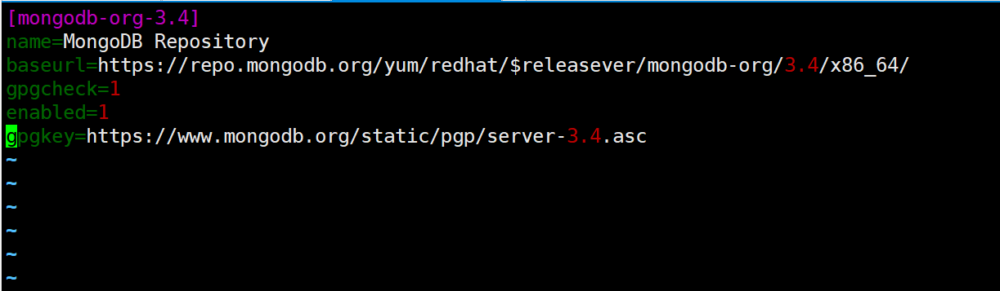
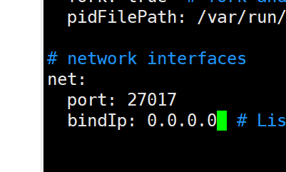
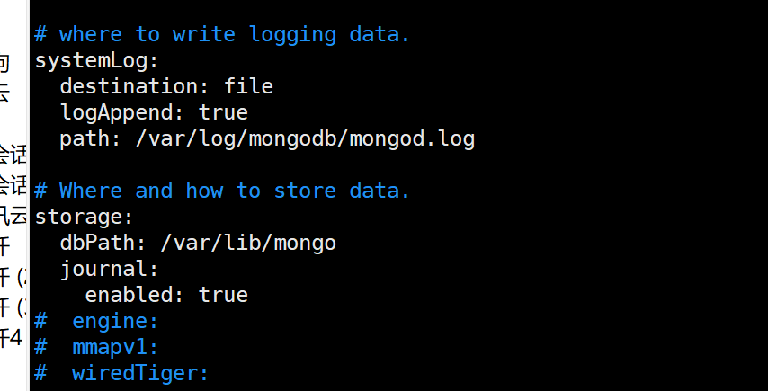
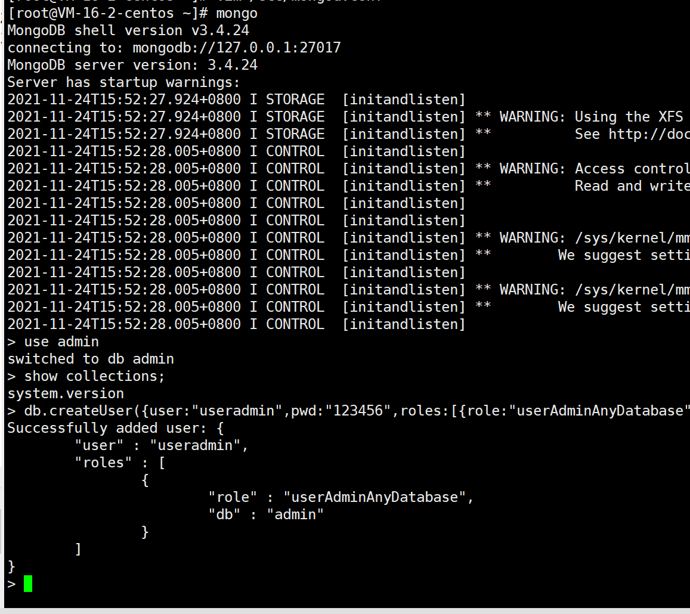
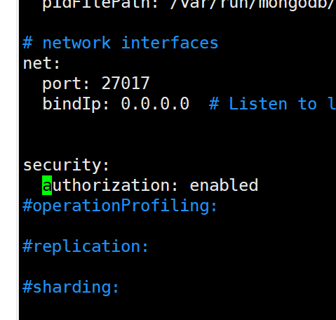
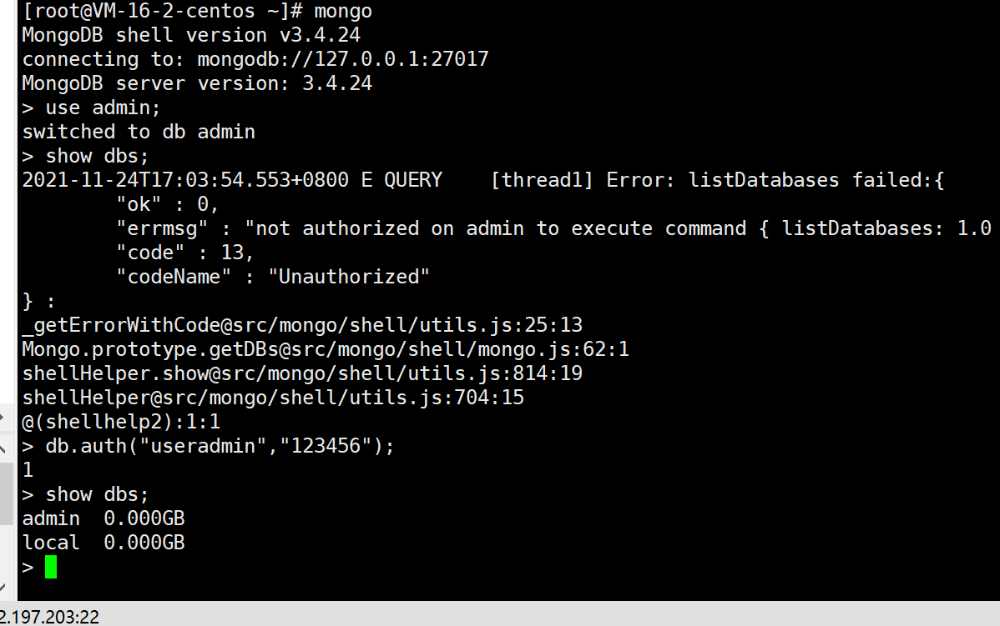
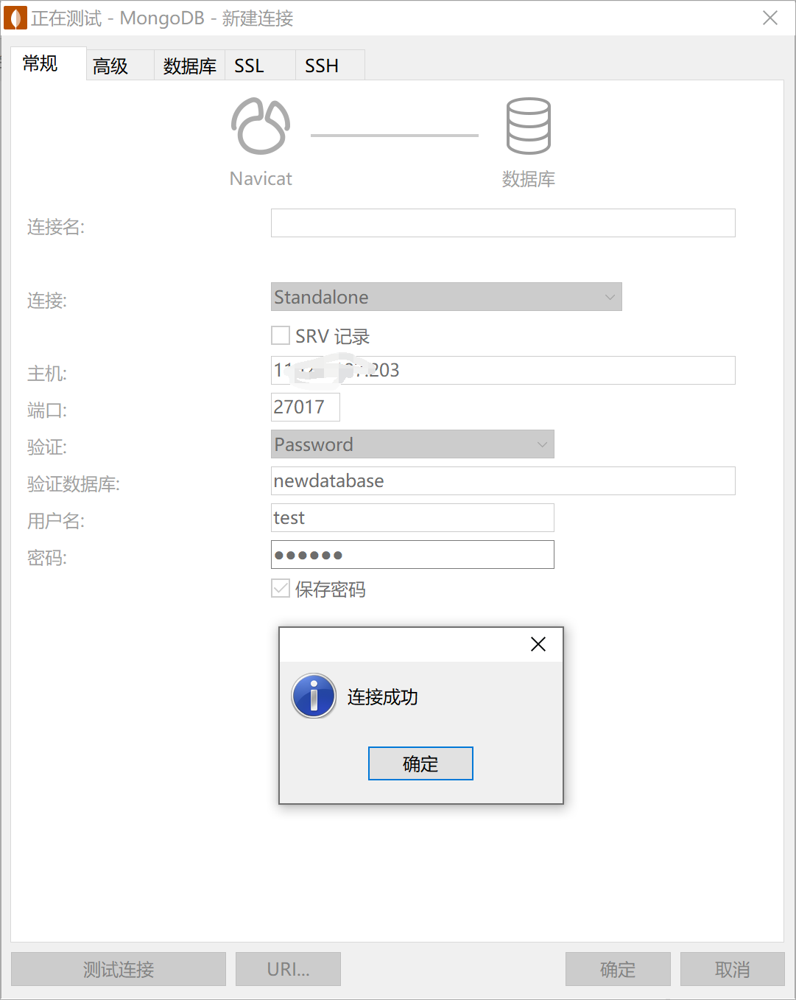

### 系统
centos7.2

## 安装

```
vim /etc/yum.repos.d/mongodb-org-3.4.repo
```
创建mongodb-org-3.4.repo并输入以下内容。
```
[mongodb-org-3.4]
name=MongoDB Repository
baseurl=https://repo.mongodb.org/yum/redhat/$releasever/mongodb-org/3.4/x86_64/
gpgcheck=1
enabled=1
gpgkey=https://www.mongodb.org/static/pgp/server-3.4.asc
```

保存后退出执行`yum install -y mongodb-org`
安装完成后执行`vi /etc/mongod.conf`
修改bind_ip为0.0.0.0。

启动命令
```
service mongod start
```
停止命令
```
service mongod stop
```
重启命令
```
service mongod restart
```
mongoDB默认数据在`/var/lib/mongo`，默认日志在`/var/log/mongodb/`



## 卸载
```
yum erase $(rpm -qa | grep mongodb-org)
```
## 使用
输入`mongo`进入。

### 安全认证
[权限验证](https://blog.csdn.net/skh2015java/article/details/83545712)
```
# 进入mongodb
mongo

# 切换至 admin 库
use admin;

# 创建管理员账号
db.createUser({user:"useradmin",pwd:"123456",roles:[{role:"userAdminAnyDatabase",db:"admin"}]})
```


执行`exit;`退出mongoDB。  
编辑`vim /etc/mongod.conf`   
加上
```
security:
  authorization: enabled
```

重启服务
```
service mongod restart
```
重新进入mongo；
```
mongo
use admin;
# 此时无法查看
show dbs;

db.auth("useradmin","123456");
show dbs;

```


### 创建数据库
```
mongo

use admin;
db.auth("useradmin","123456");
use newdatabase; 
```
`use newdatabase` 如果库不存在则创建。  
接下来创建用户。
```
db.createUser({user:"test",pwd:"123456",roles:[{role:"dbOwner",db:"newdatabase"}]});
```

### 远程连接
工具：Navicat
