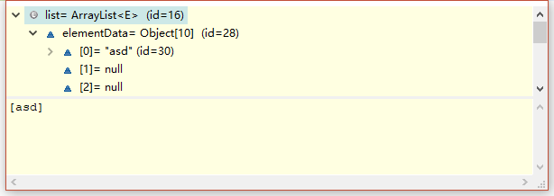
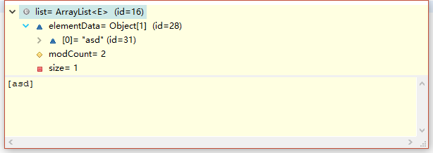

集合对于JAVA来说是一个非常基础也非常重要的东西，因为任何数据都需要存储。
而ArrayList,在我初入这行业时，只要用到集合数组第一时间就会想到它。在经历过过几年磨砺之后，ArrayList也不再是我唯一了解的集合了，但并不代表着用不到它，为了更好的运用各种集合，就有必要进行源码的阅读。
<!--more-->
# ArrayList概述
ArrayList底层其实是数组，一个动态数组，容量能够动态增长。
它继承了AbstractList，实现了List、RandomAccess、Cloneable、java.io.Serializable这些接口。
RandomAccess是一个标志接口，表明实现这个接口的List集合是支持快速随机访问的。
快速随机访问：在ArrayList中通过元素的序号快速获取元素对象，这就是快速随机访问。
Cloneable也是个标记接口，表明能被克隆。
java.io.Serializable表示ArrayList支持序列化。
ArrayList不是线程安全，建议在单线程中使用ArrayList.
# 常量变量
``` java
private static final int DEFAULT_CAPACITY = 10; //默认容量
private static final Object[] EMPTY_ELEMENTDATA = {};  //空数组，用于空实例
private static final Object[] DEFAULTCAPACITY_EMPTY_ELEMENTDATA = {};//空数组
transient Object[] elementData;//元素所在数组。transient:表示不参与序列化
private int size;  //arrayList中所包含元素的个数
```
# 构造函数
## ArrayList(int initialCapacity)
构建长度为 initialCapacity的数组。
``` java
public ArrayList(int initialCapacity) {
    if (initialCapacity > 0) {
        this.elementData = new Object[initialCapacity];
    } else if (initialCapacity == 0) {
        this.elementData = EMPTY_ELEMENTDATA;
    } else {
        throw new IllegalArgumentException("Illegal Capacity: "+
                                           initialCapacity);
    }
}
```
## ArrayList()
默认构造函数，构建一个空数组，也就是说当添加第一个元素的时候，数组容量才变为10。
``` java
public ArrayList() {
    this.elementData = DEFAULTCAPACITY_EMPTY_ELEMENTDATA;
}
```
## ArrayList(Collection<? extends E> c)
构建一个包含指定集合元素的数组
``` java
public ArrayList(Collection<? extends E> c) {
    elementData = c.toArray();
    if ((size = elementData.length) != 0) {
        // c.toArray 可能返回的不是Object类型的数组
        if (elementData.getClass() != Object[].class)
            elementData = Arrays.copyOf(elementData, size, Object[].class);
    } else {
        // 返回空数组
        this.elementData = EMPTY_ELEMENTDATA;
    }
}
```
# ArrayList扩容机制相关代码
**ArrayList的核心扩容方法是grow()。**
**ensureExplicitCapacity(int minCapacity)判断是否需要扩容，如需扩容则执行grow()**

## ensureCapacity(int minCapacity)
目前来看此方法是手动扩容。minCapacity为最小容量。
``` java
public void ensureCapacity(int minCapacity) {
    int minExpand = (elementData != DEFAULTCAPACITY_EMPTY_ELEMENTDATA)
        // any size if not default element table
        ? 0
        // larger than default for default empty table. It's already
        // supposed to be at default size.
        : DEFAULT_CAPACITY;

    if (minCapacity > minExpand) {
        ensureExplicitCapacity(minCapacity);
    }
}
```
## calculateCapacity(Object[] elementData, int minCapacity)
判断最小扩容量，当前ArrayList为空时，最小扩容数至少为10.
``` java
private static int calculateCapacity(Object[] elementData, int minCapacity) {
    if (elementData == DEFAULTCAPACITY_EMPTY_ELEMENTDATA) {
        return Math.max(DEFAULT_CAPACITY, minCapacity);
    }
    return minCapacity;
}
```
## ensureExplicitCapacity(int minCapacity)
判断是否进行扩容，当需要最小容量minCapacity大于当前剩余容量时，进行扩容。
``` java
private void ensureExplicitCapacity(int minCapacity) {
    modCount++;

    // overflow-conscious code
    if (minCapacity - elementData.length > 0)
        grow(minCapacity);
}
```
``` java
private static final int MAX_ARRAY_SIZE = Integer.MAX_VALUE - 8;//ArrayList的最大容量
```
## grow(int minCapacity)
oldCapacity表示扩容前容量。
newCapacity新的容量大小。
这里>>表示位运算符。>>1相当于除2，也就是说ArrayList每次以1.5倍扩容。
当最小容量minCapacity比newCapacity时，扩容量为minCapacity。
当新的容量比ArrayList的最大容量还大时候，进行hugeCapacity()最大容量判断。
最后得出新的容量进行扩容。
``` java
private void grow(int minCapacity) {
    // overflow-conscious code
    int oldCapacity = elementData.length;
    int newCapacity = oldCapacity + (oldCapacity >> 1);
    if (newCapacity - minCapacity < 0)
        newCapacity = minCapacity;
    if (newCapacity - MAX_ARRAY_SIZE > 0)
        newCapacity = hugeCapacity(minCapacity);
    // minCapacity is usually close to size, so this is a win:
    elementData = Arrays.copyOf(elementData, newCapacity);
}
```
## hugeCapacity(int minCapacity)
若minACapacity大于MAX_ARRAY_SIZE返回Integer.MAX_VALUE，否则返回MAX_ARRAY_SIZE
``` java
private static int hugeCapacity(int minCapacity) {
    if (minCapacity < 0) // overflow
        throw new OutOfMemoryError();
    return (minCapacity > MAX_ARRAY_SIZE) ?
        Integer.MAX_VALUE :
        MAX_ARRAY_SIZE;
}
```
# 其他方法
## trimToSize()
将ArrayList的容量大小变为当前元素的个数，内存紧张的时候可以使用。
ArrayList每次扩容都会多申请一些空间，导致size为100的时候，其空间可能为120。
trimToSize可去除多余的20空间，将其变为100。


``` java
public void trimToSize() {
    modCount++;
    if (size < elementData.length) {
        elementData = (size == 0)
          ? EMPTY_ELEMENTDATA
          : Arrays.copyOf(elementData, size);
    }
}
```
## size()
返回当前元素数量。
``` java
public int size() {
    return size;
}
```
## isEmpty()
判断当前ArrayList是否含有元素。
``` java
public boolean contains(Object o) {
    return indexOf(o) >= 0;
}
```
## indexOf(Object o)
返回列表中第一次出现元素o的索引。不包含就返回-1。
``` java
public int indexOf(Object o) {
    if (o == null) {
        for (int i = 0; i < size; i++)
            if (elementData[i]==null)
                return i;
    } else {
        for (int i = 0; i < size; i++)
            if (o.equals(elementData[i]))
                return i;
    }
    return -1;
}
```
## lastIndexOf(Object o)
o最后一次出现的索引，若不包含就返回-1。
``` java
public int lastIndexOf(Object o) {
    if (o == null) {
        for (int i = size-1; i >= 0; i--)
            if (elementData[i]==null)
                return i;
    } else {
        for (int i = size-1; i >= 0; i--)
            if (o.equals(elementData[i]))
                return i;
    }
    return -1;
}
```
## clone()
克隆，元素本身不会被复制。	待完善
``` java
public Object clone() {
    try {
        ArrayList<?> v = (ArrayList<?>) super.clone();
        v.elementData = Arrays.copyOf(elementData, size);
        v.modCount = 0;
        return v;
    } catch (CloneNotSupportedException e) {
        // this shouldn't happen, since we are Cloneable
        throw new InternalError(e);
    }
}
```
## toArray()
当前List转为数组，去除空余容量返回数组。 待完善
``` java
public Object[] toArray() {
    return Arrays.copyOf(elementData, size);
}
```
## toArray(T[] a)
当前List转为数组。 需完善
``` java
public <T> T[] toArray(T[] a) {
    if (a.length < size)
        // Make a new array of a's runtime type, but my contents:
        return (T[]) Arrays.copyOf(elementData, size, a.getClass());
    System.arraycopy(elementData, 0, a, 0, size);
    if (a.length > size)
        a[size] = null;
    return a;
}
```
## get(int index)
返回指定位置的元素
``` java
public E get(int index) {
    rangeCheck(index);
    return elementData(index);
}
E elementData(int index) {
    return (E) elementData[index];
}
```
## set(int index, E element)
将指定位置index的元素替换成新元素element，并返回老元素
``` java
public E set(int index, E element) {
    rangeCheck(index);

    E oldValue = elementData(index);
    elementData[index] = element;
    return oldValue;
}
```
## add(E e)
先进行扩容判断，然后将新元素加入的列表末尾中
``` java
public boolean add(E e) {
    ensureCapacityInternal(size + 1);  // Increments modCount!!
    elementData[size++] = e;
    return true;
}
```
## add(int index, E element)
在指定位置index插入元素element
``` java
public void add(int index, E element) {
    rangeCheckForAdd(index);

    ensureCapacityInternal(size + 1);  // Increments modCount!!
    System.arraycopy(elementData, index, elementData, index + 1,
                     size - index);
    elementData[index] = element;
    size++;
}
```
## remove(int index)
移除指定位置index的元素，并返回该元素。
``` java
public E remove(int index) {
    rangeCheck(index);

    modCount++;
    E oldValue = elementData(index);

    int numMoved = size - index - 1;
    if (numMoved > 0)
        System.arraycopy(elementData, index+1, elementData, index,
                         numMoved);
    elementData[--size] = null; // clear to let GC do its work

    return oldValue;
}
```
## remove(Object o)
删除指定元素，如果元素存在返回true，否则返回false,只删除第一个与其相同的元素。
``` java
public boolean remove(Object o) {
    if (o == null) {
        for (int index = 0; index < size; index++)
            if (elementData[index] == null) {
                fastRemove(index);
                return true;
            }
    } else {
        for (int index = 0; index < size; index++)
            if (o.equals(elementData[index])) {
                fastRemove(index);
                return true;
            }
    }
    return false;
}
```
## fastRemove(int index)
类似remove(int index)
``` java
private void fastRemove(int index) {
    modCount++;
    int numMoved = size - index - 1;
    if (numMoved > 0)
        System.arraycopy(elementData, index+1, elementData, index,
                         numMoved);
    elementData[--size] = null; // clear to let GC do its work
}
```
## clear()
将列表中所有元素删除。
``` java
public void clear() {
    modCount++;

    // clear to let GC do its work
    for (int i = 0; i < size; i++)
        elementData[i] = null;

    size = 0;
}
```
## addAll(Collection<? extends E> c)
将指定集合插入到当前列表末尾。 先进行扩容判断，后插入，如果插入集合不为空就返回true,否则返回false
``` java
public boolean addAll(Collection<? extends E> c) {
    Object[] a = c.toArray();
    int numNew = a.length;
    ensureCapacityInternal(size + numNew);  // Increments modCount
    System.arraycopy(a, 0, elementData, size, numNew);
    size += numNew;
    return numNew != 0;
}
```
## addAll(int index, Collection<? extends E> c)
将集合c从指定位置index开始插入
``` java
public boolean addAll(int index, Collection<? extends E> c) {
    rangeCheckForAdd(index);

    Object[] a = c.toArray();
    int numNew = a.length;
    ensureCapacityInternal(size + numNew);  // Increments modCount

    int numMoved = size - index;
    if (numMoved > 0)
        System.arraycopy(elementData, index, elementData, index + numNew,
                         numMoved);

    System.arraycopy(a, 0, elementData, index, numNew);
    size += numNew;
    return numNew != 0;
}
```
## removeRange(int fromIndex, int toIndex)
将从fromIndex开始到toIndex的之间元素删除，包含fromIndex
``` java
protected void removeRange(int fromIndex, int toIndex) {
    modCount++;
    int numMoved = size - toIndex;
    System.arraycopy(elementData, toIndex, elementData, fromIndex,
                     numMoved);

    // clear to let GC do its work
    int newSize = size - (toIndex-fromIndex);
    for (int i = newSize; i < size; i++) {
        elementData[i] = null;
    }
    size = newSize;
}
```
## rangeCheck(int index)
检测index是否在列表中元素的范围内。
``` java
private void rangeCheck(int index) {
    if (index >= size)
        throw new IndexOutOfBoundsException(outOfBoundsMsg(index));
}
```
## rangeCheckForAdd(int index)
和rangeCheck(int index) 差不多，就多了一个小于0的判断
``` java
private void rangeCheckForAdd(int index) {
    if (index > size || index < 0)
        throw new IndexOutOfBoundsException(outOfBoundsMsg(index));
}
```
## outOfBoundsMsg(int index)
返回字符串。包含index跟列表中元素个数。
``` java
private String outOfBoundsMsg(int index) {
    return "Index: "+index+", Size: "+size;
}
```
## removeAll(Collection<?> c)
删除列表中 集合c包含的元素
``` java
public boolean removeAll(Collection<?> c) {
    Objects.requireNonNull(c);
    return batchRemove(c, false);
}
```
## retainAll(Collection<?> c)
删除列表中 集合c不包含的元素
``` java
public boolean retainAll(Collection<?> c) {
    Objects.requireNonNull(c);
    return batchRemove(c, true);
}
```
## batchRemove(Collection<?> c, boolean complement)
removeAll跟retainAll的具体实现方法
``` java
private boolean batchRemove(Collection<?> c, boolean complement) {
    final Object[] elementData = this.elementData;
    int r = 0, w = 0;
    boolean modified = false;
    try {
        for (; r < size; r++)
            if (c.contains(elementData[r]) == complement)
                elementData[w++] = elementData[r];
    } finally {
        // Preserve behavioral compatibility with AbstractCollection,
        // even if c.contains() throws.
        if (r != size) {
            System.arraycopy(elementData, r,
                             elementData, w,
                             size - r);
            w += size - r;
        }
        if (w != size) {
            // clear to let GC do its work
            for (int i = w; i < size; i++)
                elementData[i] = null;
            modCount += size - w;
            size = w;
            modified = true;
        }
    }
    return modified;
}
```
## writeObject和readObject
当new一个ArrayList对象时，会创建一个长度为10的数组，这时候采用默认序列化，会把数组中null也序列化至文件中。
所以elementData 声明为transient类型，不会自行处理这个数组，然后就有了ArrayList的write/readObject方法，避免浪费资源去存储空数据。
s.defaultWriteObject()方法，先将除了transient类型的其他数据序列化，然后s.writeInt(sieze)把数组大小序列化，再s.writeObject(elementData[i]把数组中有值的元素一一序列化。
``` java
private void writeObject(java.io.ObjectOutputStream s)
        throws java.io.IOException
private void readObject(java.io.ObjectInputStream s)
        throws java.io.IOException, ClassNotFoundException
```
# 内部类
## Itr
``` java
private class Itr implements Iterator<E> {
    int cursor;       // 下个元素的索引
    int lastRet = -1; // 最后一个元素的索引，-1表示没有
    int expectedModCount = modCount;//modeCount:ArrayLIst的修改次数;

    Itr() {}

    public boolean hasNext() {//是否还有下个元素
        return cursor != size;
    }

    @SuppressWarnings("unchecked")
    public E next() {//获取下一个元素
        checkForComodification();
        int i = cursor;
        if (i >= size)
            throw new NoSuchElementException();
        Object[] elementData = ArrayList.this.elementData;
        if (i >= elementData.length)
            throw new ConcurrentModificationException();
        cursor = i + 1;
        return (E) elementData[lastRet = i];
    }

    public void remove() {//删除最后一个元素
        if (lastRet < 0)
            throw new IllegalStateException();
        checkForComodification();

        try {
            ArrayList.this.remove(lastRet);
            cursor = lastRet;
            lastRet = -1;
            expectedModCount = modCount;
        } catch (IndexOutOfBoundsException ex) {
            throw new ConcurrentModificationException();
        }
    }

    @Override
    @SuppressWarnings("unchecked")
    public void forEachRemaining(Consumer<? super E> consumer) {
        Objects.requireNonNull(consumer);
        final int size = ArrayList.this.size;
        int i = cursor;
        if (i >= size) {
            return;
        }
        final Object[] elementData = ArrayList.this.elementData;
        if (i >= elementData.length) {
            throw new ConcurrentModificationException();
        }
        while (i != size && modCount == expectedModCount) {
            consumer.accept((E) elementData[i++]);
        }
        // update once at end of iteration to reduce heap write traffic
        cursor = i;
        lastRet = i - 1;
        checkForComodification();
    }

    final void checkForComodification() { //是否对集合进行修改
        if (modCount != expectedModCount)
            throw new ConcurrentModificationException();
    }
}
```
## ListItr
``` java
private class ListItr extends Itr implements ListIterator<E> {
    ListItr(int index) {
        super();
        cursor = index;
    }

    public boolean hasPrevious() { //是否有前一个元素
        return cursor != 0;
    }

    public int nextIndex() { //获取当前下一个cursor元素的索引
        return cursor;
    }

    public int previousIndex() {//获取上一个cursor元素的索引
        return cursor - 1;
    }

    @SuppressWarnings("unchecked")
    public E previous() {	//返回上一个元素
        checkForComodification();
        int i = cursor - 1;
        if (i < 0)
            throw new NoSuchElementException();
        Object[] elementData = ArrayList.this.elementData;
        if (i >= elementData.length)
            throw new ConcurrentModificationException();
        cursor = i;
        return (E) elementData[lastRet = i];
    }

    public void set(E e) {	//设置元素
        if (lastRet < 0)
            throw new IllegalStateException();
        checkForComodification();

        try {
            ArrayList.this.set(lastRet, e);
        } catch (IndexOutOfBoundsException ex) {
            throw new ConcurrentModificationException();
        }
    }

    public void add(E e) { //添加元素  为什么lastRet要变为-1
        checkForComodification();

        try {
            int i = cursor;
            ArrayList.this.add(i, e);
            cursor = i + 1;
            lastRet = -1;
            expectedModCount = modCount;
        } catch (IndexOutOfBoundsException ex) {
            throw new ConcurrentModificationException();
        }
    }
}
```
## SubList
大部分调用的是ListIterator匿名内部类,相差不多。
## ArrayListSpliterator
待研究
